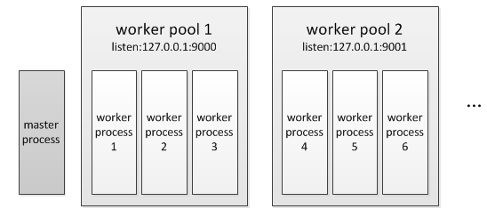
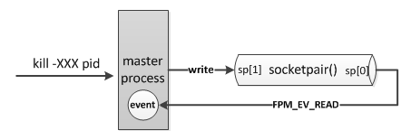

## 1.3 FPM
### 1.3.1 概述
FPM(FastCGI Process Manager)是PHP FastCGI运行模式的一个进程管理器，从它的定义可以看出，FPM的核心功能是进程管理，那么它用来管理什么进程呢？这个问题就需要从FastCGI说起了。

FastCGI是Web服务器(如：Nginx、Apache)和处理程序之间的一种通信协议，它是与Http类似的一种应用层通信协议，注意：它只是一种协议！

前面曾一再强调，PHP只是一个脚本解析器，你可以把它理解为一个普通的函数，输入是PHP脚本。输出是执行结果，假如我们想用PHP代替shell，在命令行中执行一个文件，那么就可以写一个程序来嵌入PHP解析器，这就是cli模式，这种模式下PHP就是普通的一个命令工具。接着我们又想：能不能让PHP处理http请求呢？这时就涉及到了网络处理，PHP需要接收请求、解析协议，然后处理完成返回请求。在网络应用场景下，PHP并没有像Golang那样实现http网络库，而是实现了FastCGI协议，然后与web服务器配合实现了http的处理，web服务器来处理http请求，然后将解析的结果再通过FastCGI协议转发给处理程序，处理程序处理完成后将结果返回给web服务器，web服务器再返回给用户，如下图所示。


PHP实现了FastCGI协议的解析，但是并没有具体实现网络处理，一般的处理模型：多进程、多线程，多进程模型通常是主进程只负责管理子进程，而基本的网络事件由各个子进程处理，nginx、fpm就是这种模式；另一种多线程模型与多进程类似，只是它是线程粒度，通常会由主线程监听、接收请求，然后交由子线程处理，memcached就是这种模式，有的也是采用多进程那种模式：主线程只负责管理子线程不处理网络事件，各个子线程监听、接收、处理请求，memcached使用udp协议时采用的是这种模式。

### 1.3.2 基本实现
概括来说，fpm的实现就是创建一个master进程，在master进程中创建并监听socket，然后fork出多个子进程，这些子进程各自accept请求，子进程的处理非常简单，它在启动后阻塞在accept上，有请求到达后开始读取请求数据，读取完成后开始处理然后再返回，在这期间是不会接收其它请求的，也就是说fpm的子进程同时只能响应一个请求，只有把这个请求处理完成后才会accept下一个请求，这一点与nginx的事件驱动有很大的区别，nginx的子进程通过epoll管理套接字，如果一个请求数据还未发送完成则会处理下一个请求，即一个进程会同时连接多个请求，它是非阻塞的模型，只处理活跃的套接字。

fpm的master进程与worker进程之间不会直接进行通信，master通过共享内存获取worker进程的信息，比如worker进程当前状态、已处理请求数等，当master进程要杀掉一个worker进程时则通过发送信号的方式通知worker进程。

fpm可以同时监听多个端口，每个端口对应一个worker pool，而每个pool下对应多个worker进程，类似nginx中server概念。



在php-fpm.conf中通过`[pool name]`声明一个worker pool：
```
[web1]
listen = 127.0.0.1:9000
...

[web2]
listen = 127.0.0.1:9001
...
```
启动fpm后查看进程：ps -aux|grep fpm
```c
root     27155  0.0  0.1 144704  2720 ?        Ss   15:16   0:00 php-fpm: master process (/usr/local/php7/etc/php-fpm.conf)
nobody   27156  0.0  0.1 144676  2416 ?        S    15:16   0:00 php-fpm: pool web1
nobody   27157  0.0  0.1 144676  2416 ?        S    15:16   0:00 php-fpm: pool web1
nobody   27159  0.0  0.1 144680  2376 ?        S    15:16   0:00 php-fpm: pool web2
nobody   27160  0.0  0.1 144680  2376 ?        S    15:16   0:00 php-fpm: pool web2
```
具体实现上worker pool通过`fpm_worker_pool_s`这个结构表示，多个worker pool组成一个单链表：
```c
struct fpm_worker_pool_s {
    struct fpm_worker_pool_s *next; //指向下一个worker pool
    struct fpm_worker_pool_config_s *config; //conf配置:pm、max_children、start_servers...
    int listening_socket; //监听的套接字
    ...

    //以下这个值用于master定时检查、记录worker数
    struct fpm_child_s *children; //当前pool的worker链表
    int running_children; //当前pool的worker运行总数
    int idle_spawn_rate;
    int warn_max_children;

    struct fpm_scoreboard_s *scoreboard; //记录worker的运行信息，比如空闲、忙碌worker数
    ...
}
```
### 1.3.3 FPM的初始化
接下来看下fpm的启动流程，从`main()`函数开始：
```c
//sapi/fpm/fpm/fpm_main.c
int main(int argc, char *argv[])
{
    ...
    //注册SAPI:将全局变量sapi_module设置为cgi_sapi_module
    sapi_startup(&cgi_sapi_module);
    ...
    //执行php_module_starup()
    if (cgi_sapi_module.startup(&cgi_sapi_module) == FAILURE) {
        return FPM_EXIT_SOFTWARE;
    }
    ...
    //初始化
    if(0 > fpm_init(...)){
        ...
    }
    ...
    fpm_is_running = 1;

    fcgi_fd = fpm_run(&max_requests);//后面都是worker进程的操作，master进程不会走到下面
    parent = 0;
    ...
}
```
`fpm_init()`主要有以下几个关键操作：

__(1)fpm_conf_init_main():__ 

解析php-fpm.conf配置文件，分配worker pool内存结构并保存到全局变量中：fpm_worker_all_pools，各worker pool配置解析到`fpm_worker_pool_s->config`中。

__(2)fpm_scoreboard_init_main():__ 分配用于记录worker进程运行信息的共享内存，按照worker pool的最大worker进程数分配，每个worker pool分配一个`fpm_scoreboard_s`结构，pool下对应的每个worker进程分配一个`fpm_scoreboard_proc_s`结构，各结构的对应关系如下图。


__(3)fpm_signals_init_main():__ 
```c
static int sp[2];

int fpm_signals_init_main()
{
    struct sigaction act;

    //创建一个全双工管道
    if (0 > socketpair(AF_UNIX, SOCK_STREAM, 0, sp)) {
        return -1;
    }
    //注册信号处理handler
    act.sa_handler = sig_handler;
    sigfillset(&act.sa_mask);
    if (0 > sigaction(SIGTERM,  &act, 0) ||
        0 > sigaction(SIGINT,   &act, 0) ||
        0 > sigaction(SIGUSR1,  &act, 0) ||
        0 > sigaction(SIGUSR2,  &act, 0) ||
        0 > sigaction(SIGCHLD,  &act, 0) ||
        0 > sigaction(SIGQUIT,  &act, 0)) {
        return -1;
    }
    return 0;
}
```
这里会通过`socketpair()`创建一个管道，这个管道并不是用于master与worker进程通信的，它只在master进程中使用，具体用途在稍后介绍event事件处理时再作说明。另外设置master的信号处理handler，当master收到SIGTERM、SIGINT、SIGUSR1、SIGUSR2、SIGCHLD、SIGQUIT这些信号时将调用`sig_handler()`处理：
```c
static void sig_handler(int signo)
{
    static const char sig_chars[NSIG + 1] = {
        [SIGTERM] = 'T',
        [SIGINT]  = 'I',
        [SIGUSR1] = '1',
        [SIGUSR2] = '2',
        [SIGQUIT] = 'Q',
        [SIGCHLD] = 'C'
    };
    char s;
    ...
    s = sig_chars[signo];
    //将信号通知写入管道sp[1]端
    write(sp[1], &s, sizeof(s));
    ...
}
```
__(4)fpm_sockets_init_main()__

创建每个worker pool的socket套接字。

__(5)fpm_event_init_main():__

启动master的事件管理，fpm实现了一个事件管理器用于管理IO、定时事件，其中IO事件通过kqueue、epoll、poll、select等管理，定时事件就是定时器，一定时间后触发某个事件。

在`fpm_init()`初始化完成后接下来就是最关键的`fpm_run()`操作了，此环节将fork子进程，启动进程管理器，另外master进程将不会再返回，只有各worker进程会返回，也就是说`fpm_run()`之后的操作均是worker进程的。
```c
int fpm_run(int *max_requests)
{
    struct fpm_worker_pool_s *wp;
    for (wp = fpm_worker_all_pools; wp; wp = wp->next) {
        //调用fpm_children_make() fork子进程
        is_parent = fpm_children_create_initial(wp);
        
        if (!is_parent) {
            goto run_child;
        }
    }
    //master进程将进入event循环，不再往下走
    fpm_event_loop(0);

run_child: //只有worker进程会到这里

    *max_requests = fpm_globals.max_requests;
    return fpm_globals.listening_socket; //返回监听的套接字
}
```
在fork后worker进程返回了监听的套接字继续main()后面的处理，而master将永远阻塞在`fpm_event_loop()`，接下来分别介绍master、worker进程的后续操作。

### 1.3.4 处理请求
`fpm_run()`执行后将fork出worker进程，worker进程返回`main()`中继续向下执行，后面的流程就是worker进程不断accept请求，然后执行PHP脚本并返回。整体流程如下：

* __(1)等待请求：__ worker进程阻塞在fcgi_accept_request()等待请求；
* __(2)解析请求：__ fastcgi请求到达后被worker接收，然后开始接收并解析请求数据，直到request数据完全到达；
* __(3)请求初始化：__ 执行php_request_startup()，此阶段会调用每个扩展的：PHP_RINIT_FUNCTION()；
* __(4)编译、执行：__ 由php_execute_script()完成PHP脚本的编译、执行；
* __(5)关闭请求：__ 请求完成后执行php_request_shutdown()，此阶段会调用每个扩展的：PHP_RSHUTDOWN_FUNCTION()，然后进入步骤(1)等待下一个请求。

```c
int main(int argc, char *argv[])
{
    ...
    fcgi_fd = fpm_run(&max_requests);
    parent = 0;

    //初始化fastcgi请求
    request = fpm_init_request(fcgi_fd);
    
    //worker进程将阻塞在这，等待请求
    while (EXPECTED(fcgi_accept_request(request) >= 0)) {
        SG(server_context) = (void *) request;
        init_request_info();
        
        //请求开始
        if (UNEXPECTED(php_request_startup() == FAILURE)) {
            ...
        }
        ...

        fpm_request_executing();
        //编译、执行PHP脚本
        php_execute_script(&file_handle);
        ...
        //请求结束
        php_request_shutdown((void *) 0);
        ...
    }
    ...
    //worker进程退出
    php_module_shutdown();
    ...
}
```
worker进程一次请求的处理被划分为5个阶段：
    
* __FPM_REQUEST_ACCEPTING:__ 等待请求阶段
* __FPM_REQUEST_READING_HEADERS:__ 读取fastcgi请求header阶段
* __FPM_REQUEST_INFO:__ 获取请求信息阶段，此阶段是将请求的method、query stirng、request uri等信息保存到各worker进程的fpm_scoreboard_proc_s结构中，此操作需要加锁，因为master进程也会操作此结构
* __FPM_REQUEST_EXECUTING:__ 执行请求阶段
* __FPM_REQUEST_END:__ 没有使用
* __FPM_REQUEST_FINISHED:__ 请求处理完成

worker处理到各个阶段时将会把当前阶段更新到`fpm_scoreboard_proc_s->request_stage`，master进程正是通过这个标识判断worker进程是否空闲的。

### 1.3.5 进程管理
这一节我们来看下master是如何管理worker进程的，首先介绍下三种不同的进程管理方式：

* __static:__ 这种方式比较简单，在启动时master按照`pm.max_children`配置fork出相应数量的worker进程，即worker进程数是固定不变的
* __dynamic:__ 动态进程管理，首先在fpm启动时按照`pm.start_servers`初始化一定数量的worker，运行期间如果master发现空闲worker数低于`pm.min_spare_servers`配置数(表示请求比较多，worker处理不过来了)则会fork worker进程，但总的worker数不能超过`pm.max_children`，如果master发现空闲worker数超过了`pm.max_spare_servers`(表示闲着的worker太多了)则会杀掉一些worker，避免占用过多资源，master通过这4个值来控制worker数
* __ondemand:__ 这种方式一般很少用，在启动时不分配worker进程，等到有请求了后再通知master进程fork worker进程，总的worker数不超过`pm.max_children`，处理完成后worker进程不会立即退出，当空闲时间超过`pm.process_idle_timeout`后再退出

前面介绍到在`fpm_run()`master进程将进入`fpm_event_loop()`：
```c
void fpm_event_loop(int err)
{
    //创建一个io read的监听事件，这里监听的就是在fpm_init()阶段中通过socketpair()创建管道sp[1]
    //当sp[1]可读时将回调fpm_got_signal()
    fpm_event_set(&signal_fd_event, fpm_signals_get_fd(), FPM_EV_READ, &fpm_got_signal, NULL);
    fpm_event_add(&signal_fd_event, 0);

    //如果在php-fpm.conf配置了request_terminate_timeout则启动心跳检查
    if (fpm_globals.heartbeat > 0) {
        fpm_pctl_heartbeat(NULL, 0, NULL);
    }
    //定时触发进程管理
    fpm_pctl_perform_idle_server_maintenance_heartbeat(NULL, 0, NULL);
    
    //进入事件循环，master进程将阻塞在此
    while (1) {
        ...
        //等待IO事件
        ret = module->wait(fpm_event_queue_fd, timeout);
        ...
        //检查定时器事件
        ...
    }
}
```
这就是master整体的处理，其进程管理主要依赖注册的几个事件，接下来我们详细分析下这几个事件的功能。

__(1)sp[1]管道可读事件：__ 

在`fpm_init()`阶段master曾创建了一个全双工的管道：sp，然后在这里创建了一个sp[1]可读的事件，当sp[1]可读时将交由`fpm_got_signal()`处理，向sp[0]写数据时sp[1]才会可读，那么什么时机会向sp[0]写数据呢？前面已经提到了：当master收到注册的那几种信号时会写入sp[0]端，这个时候将触发sp[1]可读事件。



这个事件是master用于处理信号的，我们根据master注册的信号逐个看下不同用途：

* __SIGINT/SIGTERM/SIGQUIT:__ 退出fpm，在master收到退出信号后将向所有的worker进程发送退出信号，然后master退出
* __SIGUSR1:__ 重新加载日志文件，生产环境中通常会对日志进行切割，切割后会生成一个新的日志文件，如果fpm不重新加载将无法继续写入日志，这个时候就需要向master发送一个USR1的信号
* __SIGUSR2:__ 重启fpm，首先master也是会向所有的worker进程发送退出信号，然后master会调用execvp()重新启动fpm，最后旧的master退出
* __SIGCHLD:__ 这个信号是子进程退出时操作系统发送给父进程的，子进程退出时，内核将子进程置为僵尸状态，这个进程称为僵尸进程，它只保留最小的一些内核数据结构，以便父进程查询子进程的退出状态，只有当父进程调用wait或者waitpid函数查询子进程退出状态后子进程才告终止，fpm中当worker进程因为异常原因(比如coredump了)退出而非master主动杀掉时master将受到此信号，这个时候父进程将调用waitpid()查下子进程的退出，然后检查下是不是需要重新fork新的worker

具体处理逻辑在`fpm_got_signal()`函数中，这里不再罗列。

__(2)fpm_pctl_perform_idle_server_maintenance_heartbeat():__

这是进程管理实现的主要事件，master启动了一个定时器，每割1s触发一次，主要用于dynamic、ondemand模式下的worker管理，master会定时检查各work pool的worker进程数，通过此定时器实现worker数量的控制，处理逻辑如下：
```c
static void fpm_pctl_perform_idle_server_maintenance(struct timeval *now)
{
    for (wp = fpm_worker_all_pools; wp; wp = wp->next) {
        struct fpm_child_s *last_idle_child = NULL; //空闲时间最久的worker
        int idle = 0; //空闲worker数
        int active = 0; //忙碌worker数
        
        for (child = wp->children; child; child = child->next) {
            //根据worker进程的fpm_scoreboard_proc_s->request_stage判断
            if (fpm_request_is_idle(child)) {
                //找空闲时间最久的worker
                ...
                idle++;
            }else{
                active++;
            }
        }
        ...
        //ondemand模式
        if (wp->config->pm == PM_STYLE_ONDEMAND) {
            if (!last_idle_child) continue;

            fpm_request_last_activity(last_idle_child, &last);
            fpm_clock_get(&now);
            if (last.tv_sec < now.tv_sec - wp->config->pm_process_idle_timeout) {
                //如果空闲时间最长的worker空闲时间超过了process_idle_timeout则杀掉该worker
                last_idle_child->idle_kill = 1;
                fpm_pctl_kill(last_idle_child->pid, FPM_PCTL_QUIT);
            } 
            continue;
        }
        //dynamic
        if (wp->config->pm != PM_STYLE_DYNAMIC) continue;
        if (idle > wp->config->pm_max_spare_servers && last_idle_child) {
            //空闲worker太多了，杀掉
            last_idle_child->idle_kill = 1;
            fpm_pctl_kill(last_idle_child->pid, FPM_PCTL_QUIT);
            wp->idle_spawn_rate = 1;
            continue;
        }
        if (idle < wp->config->pm_min_spare_servers) {
            //空闲worker太少了，如果总worker数未达到max数则fork
            ...
        }
    }
}
```
__(3)fpm_pctl_heartbeat():__

这个事件是用于限制worker处理单个请求最大耗时的，php-fpm.conf中有一个`request_terminate_timeout`的配置项，如果worker处理一个请求的总时长超过了这个值那么master将会向此worker进程发送`kill -TERM`信号杀掉worker进程，此配置单位为秒，默认值为0表示关闭此机制，另外fpm打印的slow log也是在这里完成的。
```c
static void fpm_pctl_check_request_timeout(struct timeval *now)
{   
    struct fpm_worker_pool_s *wp;

    for (wp = fpm_worker_all_pools; wp; wp = wp->next) {
        int terminate_timeout = wp->config->request_terminate_timeout;
        int slowlog_timeout = wp->config->request_slowlog_timeout;
        struct fpm_child_s *child;

        if (terminate_timeout || slowlog_timeout) { 
            for (child = wp->children; child; child = child->next) {
                //检查当前当前worker处理的请求是否超时
                fpm_request_check_timed_out(child, now, terminate_timeout, slowlog_timeout);
            }
        }
    }
}
```
除了上面这几个事件外还有一个没有提到，那就是ondemand模式下master监听的新请求到达的事件，因为ondemand模式下fpm启动时是不会预创建worker的，有请求时才会生成子进程，所以请求到达时需要通知master进程，这个事件是在`fpm_children_create_initial()`时注册的，事件处理函数为`fpm_pctl_on_socket_accept()`，具体逻辑这里不再展开，比较容易理解。

到目前为止我们已经把fpm的核心实现介绍完了，事实上fpm的实现还是比较简单的。
