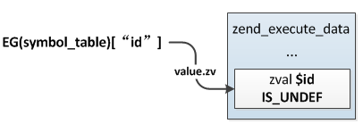

## 2.4 全局变量
PHP中在函数、类之外直接定义的变量可以在函数、类成员方法中通过global关键词引入使用，这些变量称为全局变量。

这些直接在PHP中定义的变量(包括include、require文件中的)相对于函数、类方法而言它们是全局变量，但是对自身执行域zend_execute_data而言它们是普通的局部变量，自身执行时它们与普通变量的读写方式完全相同。

```php
function test() {
    global $id;
    $id++;
}

$id = 1;
test();
echo $id;
```
### 2.4.1 全局变量初始化
全局变量在整个请求执行期间始终存在，它们保存在`EG(symbol_table)`中，也就是全局变量符号表，与静态变量的存储一样，这也是一个哈希表，主脚本(或include、require)在`zend_execute_ex`执行开始之前会把当前作用域下的所有局部变量添加到`EG(symbol_table)`中，这一步操作后面介绍zend执行过程时还会讲到，这里先简单提下：
```c
ZEND_API void zend_execute(zend_op_array *op_array, zval *return_value)
{
    ...
    i_init_execute_data(execute_data, op_array, return_value);
    zend_execute_ex(execute_data);
    ...
}
```
`i_init_execute_data()`这个函数中会把局部变量插入到EG(symbol_table)：
```c
ZEND_API void zend_attach_symbol_table(zend_execute_data *execute_data)
{
    zend_op_array *op_array = &execute_data->func->op_array;
    HashTable *ht = execute_data->symbol_table;

    if (!EXPECTED(op_array->last_var)) { 
        return;
    }

    zend_string **str = op_array->vars;
    zend_string **end = str + op_array->last_var;
    //局部变量数组起始位置
    zval *var = EX_VAR_NUM(0);

    do{
        zval *zv = zend_hash_find(ht, *str);
        //插入全局变量符号表
        zv = zend_hash_add_new(ht, *str, var);
        //哈希表中value指向局部变量的zval
        ZVAL_INDIRECT(zv, var);
        ...
    }while(str != end);
}
```
从上面的过程可以很直观的看到，在执行前遍历局部变量，然后插入EG(symbol_table)，EG(symbol_table)中的value直接指向局部变量的zval，示例经过这一步的处理之后(此时局部变量只是分配了zval，但还未初始化，所以是IS_UNDEF)：



### 2.4.2 全局变量的访问

### 2.4.3 超全局变量

### 2.4.4 销毁
