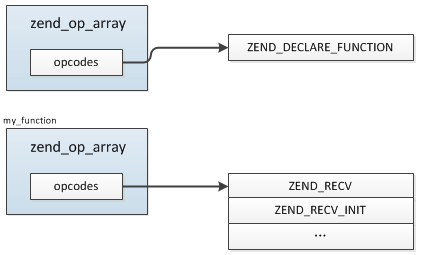

## 3.2 函数实现
函数，通俗的讲就是一组操作的集合，给予特定的输入将对应特定的输出。

### 3.2.1 用户自定义函数的实现
用户自定义函数是指我们在PHP脚本通过function定义的函数：
```php
function my_func(){
    ...
}
```
汇编中函数对应的是一组独立的汇编指令，然后通过call指令实现函数的调用，前面已经说过PHP编译的结果是opcode数组，与汇编指令对应，PHP用户自定义函数的实现就是将函数编译为独立的opcode数组，调用时分配独立的执行栈依次执行opcode，所以自定义函数对于zend而言并没有什么特别之处，只是将opcode进行了打包封装，实际PHP脚本中函数之外的指令整个可以认为是一个函数(或者理解为main函数更直观)。

```php
/* function main(){ */

$a = 123;
echo $a;

/* } */
```
#### 3.2.1.1 函数的存储结构
下面具体看下PHP中函数的结构：

```c
typedef union  _zend_function        zend_function;

//zend_compile.h
union _zend_function {
    zend_uchar type;    /* MUST be the first element of this struct! */

    struct {
        zend_uchar type;  /* never used */
        zend_uchar arg_flags[3]; /* bitset of arg_info.pass_by_reference */
        uint32_t fn_flags;
        zend_string *function_name;
        zend_class_entry *scope; //成员方法所属类，面向对象实现中用到
        union _zend_function *prototype;
        uint32_t num_args; //参数数量
        uint32_t required_num_args; //必传参数数量
        zend_arg_info *arg_info; //参数信息
    } common;

    zend_op_array op_array; //函数实际编译为普通的zend_op_array
    zend_internal_function internal_function;
};
```
这是一个union，因为PHP中函数除了用户自定义函数还有一种：内部函数，内部函数是通过扩展或者内核提供的C函数，比如time、array系列等等，内部函数稍后再作分析。

内部函数主要用到`internal_function`，而用户自定义函数编译完就是一个普通的opcode数组，用的是`op_array`（注意：op_array、internal_function是嵌入的两个结构，而不是一个单独的指针），除了这两个上面还有一个`type`跟`common`，这俩是做什么用的呢？

经过比较发现`zend_op_array`与`zend_internal_function`结构的起始位置都有`common`中的几个成员，如果你对C的内存比较了解应该会马上想到它们的用法，实际`common`可以看作是`op_array`、`internal_function`的header，不管是什么哪种函数都可以通过`zend_function.common.xx`快速访问到`zend_function.zend_op_array.xx`及`zend_function.zend_internal_function.xx`，下面几个，`type`同理，可以直接通过`zend_function.type`取到`zend_function.op_array.type`及`zend_function.internal_function.type`。


函数是在编译阶段确定的，那么它们存在哪呢？

在PHP脚本的生命周期中有一个非常重要的值`executor_globals`(非ZTS下)，类型是`struct _zend_executor_globals`，它记录着PHP生命周期中所有的数据，如果你写过PHP扩展一定用到过`EG`这个宏，这个宏实际就是对`executor_globals`的操作:`define EG(v) (executor_globals.v)`

`EG(function_table)`是一个哈希表，记录的就是PHP中所有的函数。

PHP在编译阶段将用户自定义的函数编译为独立的opcodes，保存在`EG(function_table)`中，调用时重新分配新的zend_execute_data(相当于运行栈)，然后执行函数的opcodes，调用完再还原到旧的`zend_execute_data`，继续执行，关于zend引擎execute阶段后面会详细分析。

#### 3.2.1.2 函数参数
函数参数在内核实现上与函数内的局部变量实际是一样的，上一篇我们介绍编译的时候提供局部变量会有一个单独的 __编号__ ，而函数的参数与之相同，参数名称也在zend_op_array.vars中，编号首先是从参数开始的，所以按照参数顺序其编号依次为0、1、2...(转化为相对内存偏移量就是96、112、128...)，然后函数调用时首先会在调用位置将参数的value复制到各参数各自的位置，详细的传参过程我们在执行一篇再作说明。

比如：
```php
function my_function($a, $b = "aa"){
    $ret = $a . $b;
    return $ret;
}
```
编译完后各变量的内存偏移量编号：
```
$a   => 96
$b   => 112
$ret => 128
```
与下面这么写一样：
```php
function my_function(){
    $a = NULL;
    $b = "aa";
    $ret = $a . $b;
    return $ret;
}
```
另外参数还有其它的信息，比如默认值、引用传递，这些信息通过`zend_arg_info`结构记录：
```c
typedef struct _zend_arg_info {
    zend_string *name; //参数名
    zend_string *class_name;
    zend_uchar type_hint; //显式声明的参数类型，比如(array $param_1)
    zend_uchar pass_by_reference; //是否引用传参，参数前加&的这个值就是1
    zend_bool allow_null; //是否允许为NULL,注意：这个值并不是用来表示参数是否为必传的
    zend_bool is_variadic; //是否为可变参数，即...用法，与golang的用法相同，5.6以上新增的一个用法
} zend_arg_info;
```
每个参数都有一个上面的结构，所有参数的结构保存在`zend_op_array.arg_info`数组中，这里有一个地方需要注意：`zend_op_array->arg_info`数组保存的并不全是输入参数，如果函数声明了返回值类型则也会为它创建一个`zend_arg_info`，这个结构在arg_info数组的第一个位置，这种情况下`zend_op_array->arg_info`指向的实际是数组的第二个位置，返回值的结构通过`zend_op_array->arg_info[-1]`读取，编译时的处理具体如下。
```c
//函数参数的编译
void zend_compile_params(zend_ast *ast, zend_ast *return_type_ast)
{
    zend_ast_list *list = zend_ast_get_list(ast);
    uint32_t i;
    zend_op_array *op_array = CG(active_op_array);
    zend_arg_info *arg_infos;

    if (return_type_ast) {
        //声明了返回值类型：function my_func():array{...}
        //多分配一个zend_arg_info
        arg_infos = safe_emalloc(sizeof(zend_arg_info), list->children + 1, 0);
        ...
        arg_infos->allow_null = 0;
        ...
        //arg_infos指向了下一个位置
        arg_infos++;
        op_array->fn_flags |= ZEND_ACC_HAS_RETURN_TYPE;
    } else {
        //没有声明返回值类型
        if (list->children == 0) {
            return;
        }
        arg_infos = safe_emalloc(sizeof(zend_arg_info), list->children, 0);
    }
    ...

    op_array->num_args = list->children;
    //声明了返回值的情况下arg_infos已经指向了数组的第二个元素
    op_array->arg_info = arg_infos;
}
```
#### 3.2.1.3 函数的编译
我们在上一篇文章介绍过PHP代码的编译过程，主要是PHP->AST->Opcodes的转化，上面也说了函数其实就是将一组PHP代码编译为单独的opcodes，函数的调用就是不同opcodes间的切换，所以函数的编译过程与普通PHP代码基本一致，只是会有一些特殊操作，我们以3.2.1.2开始那个例子简单看下编译过程。

普通函数的语法解析规则：
```c
function_declaration_statement:
    function returns_ref T_STRING backup_doc_comment '(' parameter_list ')' return_type
    '{' inner_statement_list '}'
        { $$ = zend_ast_create_decl(ZEND_AST_FUNC_DECL, $2, $1, $4,
            zend_ast_get_str($3), $6, NULL, $10, $8); }
;
```
规则主要由五部分组成：
* __returns_ref:__ 是否返回引用，在函数名前加&，比如function &test(){...}
* __T_STRING:__ 函数名
* __parameter_list:__ 参数列表
* __return_type:__ 返回值类型
* __inner_statement_list:__ 函数内部代码

函数生成的抽象语法树根节点类型是zend_ast_decl，所有函数相关的信息都记录在这个节点中(除了函数外类也是用的这个)：
```c
typedef struct _zend_ast_decl {
    zend_ast_kind kind; //函数就是ZEND_AST_FUNC_DECL，类则是ZEND_AST_CLASS
    zend_ast_attr attr; /* Unused - for structure compatibility */
    uint32_t start_lineno; //函数起始行
    uint32_t end_lineno;  //函数结束行
    uint32_t flags;   //其中一个标识位用来标识返回值是否为引用，是则为ZEND_ACC_RETURN_REFERENCE
    unsigned char *lex_pos;
    zend_string *doc_comment;
    zend_string *name;  //函数名
    zend_ast *child[4]; //child有4个子节点，分别是：参数列表节点、use列表节点、函数内部表达式节点、返回值类型节点
} zend_ast_decl;
```
上面的例子最终生成的语法树：


具体编译为opcodes的过程在`zend_compile_func_decl()`中：
```c
void zend_compile_func_decl(znode *result, zend_ast *ast)
{
    zend_ast_decl *decl = (zend_ast_decl *) ast;
    zend_ast *params_ast = decl->child[0]; //参数列表
    zend_ast *uses_ast = decl->child[1]; //use列表
    zend_ast *stmt_ast = decl->child[2]; //函数内部
    zend_ast *return_type_ast = decl->child[3]; //返回值类型
    zend_bool is_method = decl->kind == ZEND_AST_METHOD; //是否为成员函数

    //这里保存当前正在编译的zend_op_array：CG(active_op_array)，然后重新为函数生成一个新的zend_op_array，
    //函数编译完再将旧的还原
    zend_op_array *orig_op_array = CG(active_op_array);
    zend_op_array *op_array = zend_arena_alloc(&CG(arena), sizeof(zend_op_array)); //新分配zend_op_array
    ...
    
    if (is_method) {
        zend_bool has_body = stmt_ast != NULL;
        zend_begin_method_decl(op_array, decl->name, has_body);
    } else {
        zend_begin_func_decl(result, op_array, decl); //注意这里会在当前zend_op_array（不是新生成的函数那个）生成一条ZEND_DECLARE_FUNCTION的opcode
    }
    CG(active_op_array) = op_array;
    ...

    zend_compile_params(params_ast, return_type_ast); //编译参数
    if (uses_ast) {
        zend_compile_closure_uses(uses_ast); 
    }
    zend_compile_stmt(stmt_ast); //编译函数内部语法
    ...
    pass_two(CG(active_op_array));
    ...
    CG(active_op_array) = orig_op_array; //还原之前的
}
```
> __编译过程主要有这么几个处理：__

> __(1)__ 保存当前正在编译的zend_op_array，新分配一个结构，因为每个函数、include的文件都对应独立的一个zend_op_array，通过CG(active_op_array)记录当前编译所属zend_op_array，所以开始编译函数时就需要将这个值保存下来，等到函数编译完成再还原回去；另外还有一个关键操作：`zend_begin_func_decl`，这里会在当前zend_op_array（不是新生成的函数那个）生成一条 __ZEND_DECLARE_FUNCTION__ 的opcode，也就是函数声明操作。

```php
$a = 123;  //当前为CG(active_op_array) = zend_op_array_1，编译到这时此opcode加到zend_op_array_1

//新分配一个zend_op_array_2，并将当前CG(active_op_array)保存到origin_op_array，
//然后将CG(active_op_array)=zend_op_array_2
function test(){
    $b = 234; //编译到zend_op_array_2
}//函数编译结束，将CG(active_op_array) = origin_op_array，切回zend_op_array_1
$c = 345; //编译到zend_op_array_1
```
> __(2)__ 编译参数列表，函数的参数我们在上一小节已经介绍，完整的参数会有三个组成：参数类型(可选)、参数名、默认值(可选)，这三部分分别保存在参数节点的三个child节点中，编译参数的过程有两个关键操作：

>> __操作1：__ 为每个参数编号

>> __操作2：__ 每个参数生成一条opcode，如果是可变参数其opcode=ZEND_RECV_VARIADIC，如果有默认值则为ZEND_RECV_INIT，否则为ZEND_RECV

> 上面的例子中$a编号为96，$b为112，同时生成了两条opcode：ZEND_RECV、ZEND_RECV_INIT，调用的时候会根据具体传参数量跳过部分opcode，比如这个函数我们这么调用`my_function($a)`则ZEND_RECV这条opcode就直接跳过了，然后执行ZEND_RECV_INIT将默认值写到112位置，具体的编译过程在`zend_compile_params()`中，这里不再展开。

> __(3)__ 编译函数内部语法，这个跟普通PHP代码编译过程无异。

> __(4)__ pass_two()，上一篇介绍过，不再赘述。

最终生成两个zend_op_array：



总体来看，PHP在逐行编译时发现一个function则生成一条ZEND_DECLARE_FUNCTION的opcode，然后调到函数中编译函数，编译完再跳回去继续下面的编译，这里多次提到ZEND_DECLARE_FUNCTION这个opcode是因为在函数编译结束后还有一个重要操作：`zend_do_early_binding()`，前面我们说过总的编译入口在`zend_compile_top_stmt()`，这里会对每条语法逐条编译，而函数、类在编译完成后还有后续的操作：

```c
void zend_compile_top_stmt(zend_ast *ast)
{
    ...
    if (ast->kind == ZEND_AST_STMT_LIST) {
        for (i = 0; i < list->children; ++i) {
            zend_compile_top_stmt(list->child[i]);
        }
    }

    zend_compile_stmt(ast); //编译各条语法，函数也是在这里编译完成

    //函数编译完成后
    if (ast->kind == ZEND_AST_FUNC_DECL || ast->kind == ZEND_AST_CLASS) {
        CG(zend_lineno) = ((zend_ast_decl *) ast)->end_lineno;
        zend_do_early_binding();
    }
}
```
`zend_do_early_binding()`核心工作就是 __将function、class加到CG(function_table)、CG(class_table)中__ ，加入成功了就直接把 __ZEND_DECLARE_FUNCTION__ 这条opcode干掉了，加入失败的话则保留，这个相当于 __有一部分opcode在『编译时』提前执行了__ ，这也是为什么PHP中可以先调用函数再声明函数的原因，比如：
```php

$a = 1234;

echo my_function($a);

function my_function($a){
    ...
}
```
实际原始的opcode以及执行顺序：


类的情况也是如此，后面我们再作说明。

#### 3.2.1.4 匿名函数
匿名函数（Anonymous functions），也叫闭包函数（closures），允许临时创建一个没有指定名称的函数。最经常用作回调函数（callback）参数的值。当然，也有其它应用的情况。

官网的示例：
```php
$greet = function($name)
{
    printf("Hello %s\r\n", $name);
};

$greet('World');
$greet('PHP');
```
这里提函数函数只是想说明编译函数时那个use的用法:

__匿名函数可以从父作用域中继承变量。 任何此类变量都应该用 use 语言结构传递进去。__

```php
$message = 'hello';

$example = function () use ($message) {
    var_dump($message);
};
$example();
```

### 3.2.2 内部函数
上一节已经提过，内部函数指的是由内核、扩展提供的C语言编写的function，这类函数不需要经历opcode的编译过程，所以效率上要高于PHP用户自定义的函数，调用时与普通的C程序没有差异。

Zend引擎中定义了很多内部函数供用户在PHP中使用，比如：define、defined、strlen、method_exists、class_exists、function_exists......等等，除了Zend引擎中定义的内部函数，PHP扩展中也提供了大量内部函数，我们也可以灵活的通过扩展自行定制。

#### 3.2.2.1 内部函数结构
上一节介绍`zend_function`为union，其中`internal_function`就是内部函数用到的，具体结构：
```c
//zend_complie.h
typedef struct _zend_internal_function {
    /* Common elements */
    zend_uchar type;
    zend_uchar arg_flags[3]; /* bitset of arg_info.pass_by_reference */
    uint32_t fn_flags;
    zend_string* function_name;
    zend_class_entry *scope;
    zend_function *prototype;
    uint32_t num_args;
    uint32_t required_num_args;
    zend_internal_arg_info *arg_info;
    /* END of common elements */

    void (*handler)(INTERNAL_FUNCTION_PARAMETERS); //函数指针，展开：void (*handler)(zend_execute_data *execute_data, zval *return_value)
    struct _zend_module_entry *module;
    void *reserved[ZEND_MAX_RESERVED_RESOURCES];
} zend_internal_function;
```
`zend_internal_function`头部是一个与`zend_op_array`完全相同的common结构。

下面看下如何定义一个内部函数。

#### 3.2.2.2 定义与注册
内部函数与用户自定义函数冲突，用户无法在PHP代码中覆盖内部函数，执行PHP脚本时会提示error错误。

内部函数的定义非常简单，我们只需要创建一个普通的C函数，然后创建一个`zend_internal_function`结构添加到 __EG(function_table)__ (也可能是CG(function_table),取决于在哪一阶段注册)中即可使用，内部函数 __通常__ 情况下是在php_module_startup阶段注册的，这里之所以说通常是按照标准的扩展定义，除了扩展提供的方式我们可以在任何阶段自由定义内部函数，当然并不建议这样做。下面我们先不讨论扩展标准的定义方式，我们先自己尝试下如何注册一个内部函数。

根据`zend_internal_function`的结构我们知道需要定义一个handler：
```c
void qp_test(INTERNAL_FUNCTION_PARAMETERS)
{
    printf("call internal function 'qp_test'\n");
}
```
然后创建一个内部函数结构(我们在扩展PHP_MINIT_FUNCTION方法中注册，也可以在其他位置)：
```c
PHP_MINIT_FUNCTION(xxxxxx)
{
    zend_string *lowercase_name;
    zend_function *reg_function;

    //函数名转小写，因为php的函数不区分大小写
    lowercase_name = zend_string_alloc(7, 1);
    zend_str_tolower_copy(ZSTR_VAL(lowercase_name), "qp_test", 7);
    lowercase_name = zend_new_interned_string(lowercase_name); 

    reg_function = malloc(sizeof(zend_internal_function));
    reg_function->internal_function.type = ZEND_INTERNAL_FUNCTION; //定义类型为内部函数
    reg_function->internal_function.function_name = lowercase_name;
    reg_function->internal_function.handler = qp_test;

    zend_hash_add_ptr(CG(function_table), lowercase_name, reg_function); //注册到CG(function_table)符号表中
}
```
接着编译、安装扩展，测试：
```php
qp_test();
```
结果输出：
`call internal function 'qp_test'`

这样一个内部函数就定义完成了。这里有一个地方需要注意的我们把这个函数注册到 __CG(function_table)__ 中去了，而不是 __EG(function_table)__ ，这是因为在`php_request_startup`阶段会把 __CG(function_table)__ 赋值给 __EG(function_table)__ 。

上面的过程看着比较简单，但是在实际应用中不要这样做，PHP提供给我们一套标准的定义方式，接下来看下如何在扩展中按照官方方式提供一个内部函数。

首先也是定义C函数，这个通过`PHP_FUNCTION`宏定义：
```c
PHP_FUNCTION(qp_test)
{
    printf("call internal function 'qp_test'\n");
}
```
然后是注册过程，这个只需要我们将所有的函数数组添加到扩展结构`zend_module_entry.functions`即可，扩展加载过程中会自动进行函数注册(见1.2节)，不需要我们干预：
```c
const zend_function_entry xxxx_functions[] = {
        PHP_FE(qp_test,   NULL)
        PHP_FE_END
};

zend_module_entry xxxx_module_entry = {
    STANDARD_MODULE_HEADER,
    "扩展名称",
    xxxx_functions,
    PHP_MINIT(timeout),
    PHP_MSHUTDOWN(timeout),
    PHP_RINIT(timeout),     /* Replace with NULL if there's nothing to do at request start */
    PHP_RSHUTDOWN(timeout), /* Replace with NULL if there's nothing to do at request end */
    PHP_MINFO(timeout),
    PHP_TIMEOUT_VERSION,
    STANDARD_MODULE_PROPERTIES
};
```
关于更多扩展中函数相关的用法会在后面扩展开发一章中详细介绍，这里不再展开。


