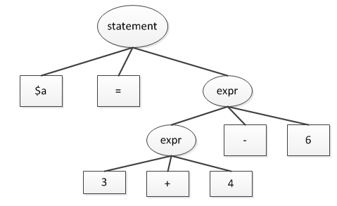

### 3.1.1 词法解析、语法解析
这一节我们分析下PHP的解析阶段，即__PHP代码->抽象语法树(AST)__的过程。

PHP使用re2c、bison完成这个阶段的工作:
* __re2c__：词法分析器，将输入分割为一个个有意义的词块，称为token
* __bison__：语法分析器，确定词法分析器分割出的token是如何彼此关联的

例如：
```php
$a = 2 + 3;
```
词法分析器将上面的语句分解为这些token：$a、=、2、+、3，接着语法分析器确定了`2+3`是一个表达式，而这个表达式被赋值给了`a`，我们可以这样定义词法解析规则：
```c
/*!re2c
    LABEL   [a-zA-Z_\x7f-\xff][a-zA-Z0-9_\x7f-\xff]*
    LNUM    [0-9]+

    //规则
    "$"{LABEL} {return T_VAR;}
    {LNUM} {return T_NUM;}
*/
```
然后定义语法解析规则：
```c
//token定义
%token T_VAR
%token T_NUM

//语法规则
statement:
    T_VAR '=' T_NUM '+' T_NUM {ret = str2int($3) + str2int($5);printf("%d",ret);}
;
```
上面的语法规则只能识别两个数值相加，假如我们希望支持更复杂的运算，比如：
```php
$a = 3 + 4 - 6;
```
则可以配置递归规则：
```c
//语法规则
statement:
    T_VAR '=' expr {}
;
expr:
    T_NUM {...}
    |expr '?' T_NUM {}
;
```
这样将支持若干表达式，用语法分析树表示：



这里不再对re2c、bison作更多解释，想要了解更多的推荐看下《flex与bison》这本书，接下来我们看下PHP具体的解析过程。


