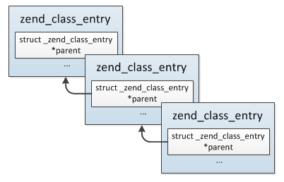
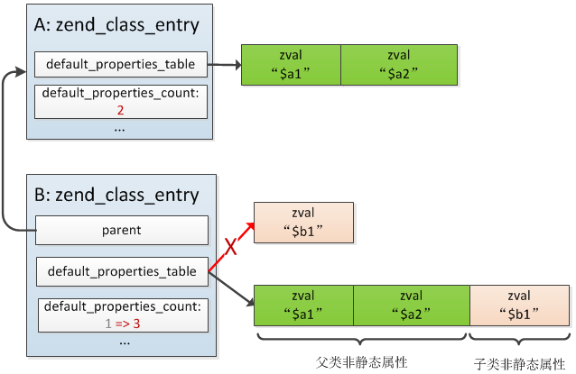

### 3.4.3 继承
继承是面向对象编程技术的一块基石，它允许创建分等级层次的类，它允许子类继承父类所有公有或受保护的特征和行为，使得子类对象具有父类的实例域和方法，或子类从父类继承方法，使得子类具有父类相同的行为。

继承对于功能的设计和抽象是非常有用的，而且对于类似的对象增加新功能就无须重新再写这些公用的功能。

PHP中通过`extends`关键词继承一个父类，一个类只允许继承一个父类，但是可以多级继承。
```php
class 父类 {
}

class 子类 extends 父类 {
}
```

前面的介绍我们已经知道，类中保存着成员属性、方法、常量等，父类与子类之间通过`zend_class_entry.parent`建立关联，如下图所示。



问题来了：每个类都有自己独立的常量、成员属性、成员方法，那么继承类父子之间的这些信息是如何进行关联的呢？接下来我们将带着这个疑问再重新分析一下类的编译过程中是如何处理继承关系的。

3.4.1.5一节详细介绍了类的编译过程，这里再简单回顾下：首先为类分配一个zend_class_entry结构，如果没有继承类则生成一条类声明的opcode(ZEND_DECLARE_CLASS)，有继承类则生成两条opcode(ZEND_FETCH_CLASS、ZEND_DECLARE_INHERITED_CLASS)，然后再继续编译常量、成员属性、成员方法注册到zend_class_entry中，最后编译完成后调用`zend_do_early_binding()`进行 __父子类关联__ 以及 __注册到EG(class_table)符号表__。

如果父类在子类之前定义的，那么父子类之间的关联就是在`zend_do_early_binding()`中完成的，这里不考虑子类在父类前定义的情况，实际两者没有本质差别，区别在于在哪一个阶段执行。有继承类的情况在`zend_do_early_binding()`中首先是查找父类，然后调用`do_bind_inherited_class()`处理，最后将`ZEND_FETCH_CLASS`、`ZEND_DECLARE_INHERITED_CLASS`两条opcode删除，这些过程前面已经介绍过了，下面我们重点看下`do_bind_inherited_class()`的处理过程。
```c
ZEND_API zend_class_entry *do_bind_inherited_class(
    const zend_op_array *op_array, //这个是定义类的地方的
    const zend_op *opline, //类声明的opcode：ZEND_DECLARE_INHERITED_CLASS
    HashTable *class_table, //CG(class_table)
    zend_class_entry *parent_ce,  //父类
    zend_bool compile_time) //是否编译时
{
     zend_class_entry *ce;
     zval *op1, *op2;

     if (compile_time) {
        op1 = CT_CONSTANT_EX(op_array, opline->op1.constant);
        op2 = CT_CONSTANT_EX(op_array, opline->op2.constant); 
     }else{
        ...
     }
     ...
     //父子类关联
     zend_do_inheritance(ce, parent_ce);
     
     //注册到CG(class_table)
     ...
}
```
上面这个函数的处理与注册非继承类的`do_bind_class()`几乎完全相同，只是多了一个`zend_do_inheritance()`一步，此函数输入很直观，只一个类及父类。
```c
//zend_inheritance.c #line:758
ZEND_API void zend_do_inheritance(zend_class_entry *ce, zend_class_entry *parent_ce)
{
    zend_property_info *property_info;
    zend_function *func;
    zend_string *key;
    zval *zv;

    //interface、trait、final类检查
    ...
    ce->parent = parent_ce;

    zend_do_inherit_interfaces(ce, parent_ce);
 
    //下面就是继承属性、常量、方法   
}
```
下面的操作我们根据一个示例逐个来看。
```php
//示例
class A {
    const A1 = 1;
    public $a1 = array(1);
    private $a2 = 120;
    
    public function get() {
        echo "A::get()";
    }   
}
class B extends A {
    const B1 = 2; 
    
    public $b1 = "ddd";
    
    public function get() {
        echo "B::get()";
    }   
}
```

#### 3.4.3.1 继承属性
前面我们已经介绍过：属性按静态、非静态分别保存在两个数组中，各属性按照定义的先后顺序编号(offset)，同时按照这个编号顺序存储排列，而这些编号信息通过`zend_property_info`结构保存，全部静态、非静态属性的`zend_property_info`保存在一个以属性名为key的HashTable中，所以检索属性时首先根据属性名找到此属性的`zend_property_info`，然后拿到其属性值的offset，再根据静态、非静态分别到`default_static_members_count`、`default_properties_table`数组中取出属性值。

当类存在继承关系时，操作方式是：__将属性从父类复制到子类__ 。子类会将父类的公共、受保护的属性值数组全部合并到子类中，然后将全部属性的`zend_property_info`哈希表也合并到子类中。

合并的步骤:

__(1)合并非静态属性default_properties_table:__ 首先申请一个父类+子类非静态属性大小的数组，然后先将父类非静态属性复制到新数组，然后再将子类的非静态数组接着父类属性的位置复制过去，子类的default_properties_table指向合并后的新数组，default_properties_count更新为新数组的大小，最后将子类旧的数组释放。
```c
if (parent_ce->default_properties_count) {
    zval *src, *dst, *end;
    ...
    zval *table = pemalloc(sizeof(zval) * (ce->default_properties_count + parent_ce->default_properties_count), ...);
    
    ce->default_properties_table = table;

    //复制父类、子类default_properties_table
    do {
        ...
    }while(dst != end);

    //更新default_properties_count为合并后的大小
    ce->default_properties_count += parent_ce->default_properties_count;
}
```
示例合并后的情况如下图。



__(2)合并静态属性default_static_members_table:__ 与非静态属性相同，新申请一个父类+子类静态属性大小的数组，依次将父类、子类静态属性复制到新数组，然后更新子类default_static_members_table指向新数组。

__(3)更新子类属性offset:__ 因为合并后原子类属性整体向后移了，所以子类属性的编号offset需要加上前面父类属性的总大小。
```c
ZEND_HASH_FOREACH_PTR(&ce->properties_info, property_info) {
    if (property_info->ce == ce) {
        if (property_info->flags & ZEND_ACC_STATIC) {
            //静态属性offset为数组下标，直接加上父类default_static_members_count即可
            property_info->offset += parent_ce->default_static_members_count;
        } else {
            //非静态属性offset为内存偏移值，按zval大小递增
            property_info->offset += parent_ce->default_properties_count * sizeof(zval);
        }
    }
} ZEND_HASH_FOREACH_END();
```
__(4)合并properties_info哈希表:__ 这也是非常关键的一步，上面只是将父类的属性值合并到了子类，但是索引属性用的是properties_info哈希表，所以需要将父类的属性索引表与子类的索引表合并。在合并的过程中就牵扯到父子类属性的继承、覆盖问题了，各种情况具体处理如下：
* __父类属性不与子类冲突 且 父类属性是私有:__ 即父类属性为private，且子类中没有重名的，则将此属性插入子类properties_info，但是更新其flag为ZEND_ACC_SHADOW，这种属性将不能被子类使用；
* __父类属性不与子类冲突 且 父类属性是公有:__ 这种比较简单，子类可以继承使用，直接插入子类properties_info；
* __父类属性与子类冲突 且 父类属性为私有:__ 不继承父类的，以子类原属性为准，但是打上`ZEND_ACC_CHANGED`的flag，这种属性父子类隔离，互不干扰；
* __父类属性与子类冲突 且 父类属性是公有或受保护的:__
    * __父子类属性一个是静态一个是非静态:__ 编译错误；
    * __父子类属性都是非静态:__ 用父类的offset，但是值用子类的，父子类共享；
    * __父子类属性都是静态:__ 不继承父类属性，以子类原属性为准，父子类隔离，互不干扰；

这个地方相对比较复杂，具体的合并策略在`do_inherit_property()`中，这里不再罗列代码。

#### 3.4.3.2 继承常量
常量的合并策略比较简单，如果父类与子类冲突时用子类的，不冲突时则将父类的常量合并到子类。
```c
static void do_inherit_class_constant(zend_string *name, zval *zv, zend_class_entry *ce, zend_class_entry *parent_ce)
{
    //父类定义的常量在子类中没有定义
    if (!zend_hash_exists(&ce->constants_table, name)) {
        ...
        _zend_hash_append(&ce->constants_table, name, zv);
    }
}
```

#### 3.4.3.3 继承方法
与属性一样，子类可以继承父类的公有、受保护的方法，方法的继承比较复杂，因为会有访问控制、抽象类、接口、Trait等多种限制条件。实现上与前面几种相同，即父类的function_table合并到子类的function_table中。

首先是将子类function_table扩大，以容纳父子类全部方法，然后遍历父类function_table，逐个判断是否可被子类继承，如果可被继承则插入到子类function_table中。
```c
if (zend_hash_num_elements(&parent_ce->function_table)) {
    //扩展子类的function_table哈希表大小
    zend_hash_extend(&ce->function_table,
            zend_hash_num_elements(&ce->function_table) +
            zend_hash_num_elements(&parent_ce->function_table), 0);

    //遍历父类function_table，检查是否可被子类继承
    ZEND_HASH_FOREACH_STR_KEY_PTR(&parent_ce->function_table, key, func) {
        zend_function *new_func = do_inherit_method(key, func, ce);

        if (new_func) {
            _zend_hash_append_ptr(&ce->function_table, key, new_func);
        }
    } ZEND_HASH_FOREACH_END();
}
```
在合并的过程中需要对父类的方法进行一系列检查，最简单的情况就是父类中定义的方法在子类中不存在，这种情况比较简单，直接将父类的zend_function复制一份给子类。
```c
static zend_function *do_inherit_method(zend_string *key, zend_function *parent, zend_class_entry *ce)
{
    zval *child = zend_hash_find(&ce->function_table, key);

    if(child){
        //方法与子类冲突
        ...
    }

    //父子类方法不冲突，直接复制
    return zend_duplicate_function(parent, ce);
}
```
当然这里不完全是复制：如果继承的父类是内部类则会硬拷贝一份zend_function结构(此结构的指针成员不复制)；如果父类是用户自定义的类，且继承的方法没有静态变量则不会硬拷贝，而是增加zend_function的引用计数(zend_op_array.refcount)。
```c
//func是父类成员方法，ce是子类
static zend_function *zend_duplicate_function(zend_function *func, zend_class_entry *ce)
{
    zend_function *new_function;

    if (UNEXPECTED(func->type == ZEND_INTERNAL_FUNCTION)) {
        //内部函数
        //如果子类也是内部类则会调用malloc分配内存(不会被回收)，否则在zend内存池分配
        ...
    }else{
        if (func->op_array.refcount) {
            (*func->op_array.refcount)++;
        }
        if (EXPECTED(!func->op_array.static_variables)) {
            return func;
        } 
        
        //硬拷贝
        new_function = zend_arena_alloc(&CG(arena), sizeof(zend_op_array));
        memcpy(new_function, func, sizeof(zend_op_array));
    }
}
```
合并时另外一个比较复杂的情况是父类与子类中的方法冲突了，即子类重写了父类的方法，这种情况需要对父子类以及要合并的方法进行一系列检查，这一步在`do_inheritance_check_on_method()`中完成，具体情况如下：
```c
static void do_inheritance_check_on_method(zend_function *child, zend_function *parent)
{
    uint32_t child_flags;
    uint32_t parent_flags = parent->common.fn_flags;
    ...
}
```

__(1)抽象子类的抽象方法与抽象父类的抽象方法冲突:__ 无法重写，Fatal错误。
```php
abstract class B extends A {
    abstract function test();
}
abstract class A
{
    abstract function test();
}

============================
PHP Fatal error:  Can't inherit abstract function A::test() (previously declared abstract in B)
```
判断逻辑：
```c
//do_inheritance_check_on_method():

if ((parent->common.scope->ce_flags & ZEND_ACC_INTERFACE) == 0 //父类非接口
        && parent->common.fn_flags & ZEND_ACC_ABSTRACT //父类方法为抽象方法
        && parent->common.scope != (child->common.prototype ? child->common.prototype->common.scope : child->common.scope)
        && child->common.fn_flags & (ZEND_ACC_ABSTRACT|ZEND_ACC_IMPLEMENTED_ABSTRACT) //子类方法为抽象或实现了抽象方法
) { 
    zend_error_noreturn(E_COMPILE_ERROR, "Can't inherit abstract function %s::%s() (previously declared abstract in %s)",...);
}
```
__(2)父类方法为final:__ Fatal错误，final成员方法不得被重写。
判断逻辑：
```c
//do_inheritance_check_on_method():

if (UNEXPECTED(parent_flags & ZEND_ACC_FINAL)) {
    zend_error_noreturn(E_COMPILE_ERROR, "Cannot override final method %s::%s()", ...);
}
```
__(3)父子类方法静态属性不一致:__ 父类方法为非静态而子类的是静态(或相反)，Fatal错误。
```php
class A {
    public function test(){}
}

class B extends A {
    static public function test(){}
}

============================
PHP Fatal error:  Cannot make non static method A::test() static in class B
```
判断逻辑：
```c
//do_inheritance_check_on_method():

if (UNEXPECTED((child_flags & ZEND_ACC_STATIC) != (parent_flags & ZEND_ACC_STATIC))) {
    zend_error_noreturn(E_COMPILE_ERROR,...);
}
```

__(4)抽象子类的抽象方法覆盖父类非抽象方法:__ Fatal错误。
```php
class A {
    public function test(){}
}

abstract class B extends A {
    abstract public function test();
}

============================
PHP Fatal error:  Cannot make non abstract method A::test() abstract in class B
```
判断逻辑：
```c
//do_inheritance_check_on_method():

if (UNEXPECTED((child_flags & ZEND_ACC_ABSTRACT) > (parent_flags & ZEND_ACC_ABSTRACT))) {
    zend_error_noreturn(E_COMPILE_ERROR, "Cannot make non abstract method %s::%s() abstract in class %s",...);
}
```
__(5)子类方法限制父类方法访问权限:__ Fatal错误，不允许派生类限制父类方法的访问权限，如父类方法为public，而子类试图重写为protected/private。
```php
class A {
    public function test(){}
}

class B extends A {
    protected function test(){}
}

============================
PHP Fatal error:  Access level to B::test() must be public (as in class A)
```
判断逻辑：
```c
//do_inheritance_check_on_method():

//ZEND_ACC_PPP_MASK = (ZEND_ACC_PUBLIC | ZEND_ACC_PROTECTED | ZEND_ACC_PRIVATE)
if (UNEXPECTED((child_flags & ZEND_ACC_PPP_MASK) > (parent_flags & ZEND_ACC_PPP_MASK))) {            
    zend_error_noreturn(E_COMPILE_ERROR, "Access level to %s::%s() must be %s (as in class %s)%s", ...);
} else if (((child_flags & ZEND_ACC_PPP_MASK) < (parent_flags & ZEND_ACC_PPP_MASK))
        && ((parent_flags & ZEND_ACC_PPP_MASK) & ZEND_ACC_PRIVATE)) {
    child->common.fn_flags |= ZEND_ACC_CHANGED;
}
```
__(6)剩余检查情况:__ 除了上面5中情形下无法重写方法，剩下还有一步对函数参数的检查，这个过程我们整体看一下。
```c
//do_inheritance_check_on_method():

if (UNEXPECTED(!zend_do_perform_implementation_check(child, parent))) {
    ...
    zend_error(error_level, "Declaration of %s %s be compatible with %s", ZSTR_VAL(child_prototype), error_verb, ZSTR_VAL(method_prototype));
    zend_string_free(child_prototype);
    zend_string_free(method_prototype);
}
```
实际上`zend_do_perform_implementation_check()`这个函数是用来检查一个方法是否实现了某抽象方法的，继承的时候遵循的也是这个规则，所以这里可以将父类方法理解为抽象方法，只有子类方法实现了该"抽象方法"才能重写父类方法。
```c
static zend_bool zend_do_perform_implementation_check(const zend_function *fe, const zend_function *proto)
{
    ...
    //如果检查的方法是__construct且父类方法不是interface和abstract则子类__construct覆盖父类的
    if ((fe->common.fn_flags & ZEND_ACC_CTOR)
        && ((proto->common.scope->ce_flags & ZEND_ACC_INTERFACE) == 0
            && (proto->common.fn_flags & ZEND_ACC_ABSTRACT) == 0)) {
        return 1;
    }

    //如果父类方法为私有方法则子类方法可以覆盖
    if (proto->common.fn_flags & ZEND_ACC_PRIVATE) {
        return 1;
    }

    //如果父类方法必传参数小于子类的或者父类的总参数大于子类的则不能覆盖
    //如：
    //  父类 public function test($a, $b = 3){}
    //  子类 public function test($a, $b){}
    if (proto->common.required_num_args < fe->common.required_num_args
        || proto->common.num_args > fe->common.num_args) {
        return 0;
    }

    //可变函数,暂未理解这里的可变函数指哪类，忽略
    ...

    //如果有定义的参数检查参数类型是否匹配，如果显式声明了参数类型则父子类方法必须匹配
    for (i = 0; i < num_args; i++) {
        zend_arg_info *fe_arg_info = &fe->common.arg_info[i];
        if (!zend_do_perform_type_hint_check(fe, fe_arg_info, proto, proto_arg_info)) {
            return 0;
        }
 
        //是否引用也必须一致       
        if (fe_arg_info->pass_by_reference != proto_arg_info->pass_by_reference) {
            return 0;
        }
    }

    //如果父类方法声明了返回值类型则子类方法必须声明且类型一致，相反如果子类声明了而父类无要求则可以
    if (proto->common.fn_flags & ZEND_ACC_HAS_RETURN_TYPE) {
        if (!(fe->common.fn_flags & ZEND_ACC_HAS_RETURN_TYPE)) {
            return 0;
        }

        if (!zend_do_perform_type_hint_check(fe, fe->common.arg_info - 1, proto, proto->common.arg_info - 1)) {
            return 0;
        }
    }
}
```
这个判断过程还是比较复杂的，有些地方很难理解为什么设计，想了解完整过程的可以自行翻下代码。


