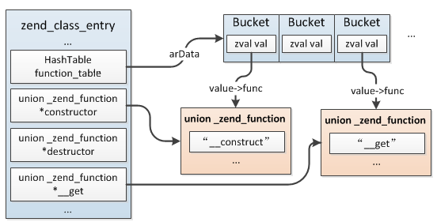

### 3.4.5 魔术方法
PHP在类的成员方法中预留了一些特殊的方法，它们会在一些特殊的时机被调用(比如创建对象之初、访问成员属性时...)，这类方法称为：魔术方法，包括：__construct()、__destruct()、__call()、__callStatic()、__get()、__set()、__isset()、__unset()、__sleep()、__wakeup()、__toString()、__invoke()、 __set_state()、 __clone() 和 __debugInfo()。

魔术方法实际是PHP提供的一些特殊操作时的钩子函数，与普通成员方法无异，它们只是与一些操作的口头约定，并没有什么字段标识它们，比如我们定义了一个函数：my_function()，我们希望在这个函数处理对象时首先调用其成员方法my_magic()，那么my_magic()也可以认为是一个魔术方法。

魔术方法与普通成员方法一样保存在`zend_class_entry.function_table`中，另外针对一些内核常用到的成员方法在zend_class_entry中还有一些单独的指针指向具体的成员方法：
```c
struct _zend_class_entry {
    ...
    union _zend_function *constructor;
    union _zend_function *destructor;
    union _zend_function *clone;
    union _zend_function *__get;
    union _zend_function *__set;
    union _zend_function *__unset;
    union _zend_function *__isset;
    union _zend_function *__call;
    union _zend_function *__callstatic;
    union _zend_function *__tostring;
    union _zend_function *__debugInfo;
    ...
}
```
在编译成员方法时如果发现与这些魔术方法名称一致，则除了插入`zend_class_entry.function_table`哈希表以外，还会设置zend_class_entry中对应的指针。




