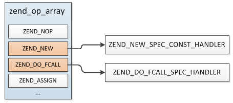

### 3.4.2 对象
对象是类的实例，PHP中要创建一个类的实例，必须使用 new 关键字。类应在被实例化之前定义（某些情况下则必须这样，比如3.4.1最后那几个例子）。

#### 3.4.2.1 对象的数据结构
对象的数据结构非常简单：
```c
typedef struct _zend_object     zend_object;

struct _zend_object {
    zend_refcounted_h gc; //引用计数
    uint32_t          handle;
    zend_class_entry *ce; //所属类
    const zend_object_handlers *handlers; //对象的一些操作接口
    HashTable        *properties;
    zval              properties_table[1]; //普通属性值数组
};

```
几个主要的成员：

__(1)ce：__ 所属类的zend_class_entry。

__(2)handlers:__ 这个保存的对象相关操作的一些函数指针，比如成员属性的读写、成员方法的获取、对象的销毁/克隆等等，这些操作接口都有默认的函数。
```c
struct _zend_object_handlers {
    int                                     offset;
    zend_object_free_obj_t                  free_obj; //释放对象
    zend_object_dtor_obj_t                  dtor_obj; //销毁对象
    zend_object_clone_obj_t                 clone_obj;//复制对象
    
    zend_object_read_property_t             read_property; //读取成员属性
    zend_object_write_property_t            write_property;//修改成员属性
    ...
}

//默认值处理handler
ZEND_API zend_object_handlers std_object_handlers = {
    0,
    zend_object_std_dtor,                   /* free_obj */
    zend_objects_destroy_object,            /* dtor_obj */
    zend_objects_clone_obj,                 /* clone_obj */
    zend_std_read_property,                 /* read_property */
    zend_std_write_property,                /* write_property */
    zend_std_read_dimension,                /* read_dimension */
    zend_std_write_dimension,               /* write_dimension */
    zend_std_get_property_ptr_ptr,          /* get_property_ptr_ptr */
    NULL,                                   /* get */
    NULL,                                   /* set */
    zend_std_has_property,                  /* has_property */
    zend_std_unset_property,                /* unset_property */
    zend_std_has_dimension,                 /* has_dimension */
    zend_std_unset_dimension,               /* unset_dimension */
    zend_std_get_properties,                /* get_properties */
    zend_std_get_method,                    /* get_method */
    NULL,                                   /* call_method */
    zend_std_get_constructor,               /* get_constructor */
    zend_std_object_get_class_name,         /* get_class_name */
    zend_std_compare_objects,               /* compare_objects */
    zend_std_cast_object_tostring,          /* cast_object */
    NULL,                                   /* count_elements */
    zend_std_get_debug_info,                /* get_debug_info */
    zend_std_get_closure,                   /* get_closure */
    zend_std_get_gc,                        /* get_gc */
    NULL,                                   /* do_operation */
    NULL,                                   /* compare */
}
```
__(3)properties_table：__ 成员属性数组，还记得我们在介绍类一节时提过非静态属性存储在对象结构中吗？就是这个properties_table！注意，它是一个数组，`zend_object`是个变长结构体，分配时会根据非静态属性的数量确定其大小。

#### 3.4.2.2 对象的创建
PHP中通过`new + 类名`创建一个类的实例，我们从一个例子分析下对象创建的过程中都有哪些操作。

```php
class my_class
{
    const TYPE = 90;
    public $name = "pangudashu";
    public $ids = array();
}

$obj = new my_class();
```
类的定义就不用再说了，我们只看`$obj = new my_class();`这一句，这条语句包括两部分：实例化类、赋值，下面看下实例化类的语法规则：
```c
new_expr:
        T_NEW class_name_reference ctor_arguments
            { $$ = zend_ast_create(ZEND_AST_NEW, $2, $3); }
    |   T_NEW anonymous_class
            { $$ = $2; }
;
```
从语法规则可以很直观的看出此语法的两个主要部分：类名、参数列表，编译器在解析到实例化类时就创建一个`ZEND_AST_NEW`类型的节点，后面编译为opcodes的过程我们不再细究，这里直接看下最终生成的opcodes。



你会发现实例化类产生了两条opcode(实际可能还会更多)：ZEND_NEW、ZEND_DO_FCALL，除了创建对象的操作还有一条函数调用的，没错，那条就是调用`构造方法`的操作。

根据opcode、操作数类型可知`ZEND_NEW`对应的处理handler为`ZEND_NEW_SPEC_CONST_HANDLER()`:
```c
static int ZEND_NEW_SPEC_CONST_HANDLER(zend_execute_data *execute_data)
{
    zval object_zval;
    zend_function *constructor;
    zend_class_entry *ce;
    ...
    //第1步：根据类名查找zend_class_entry
    ce = zend_fetch_class_by_name(Z_STR_P(EX_CONSTANT(opline->op1)), ...);
    ...
    //第2步：创建&初始化一个这个类的对象
    if (UNEXPECTED(object_init_ex(&object_zval, ce) != SUCCESS)) {
        HANDLE_EXCEPTION();
    }
    //第3步：获取构造方法
    //获取构造方法函数，实际就是直接取zend_class_entry.constructor
    //get_constructor => zend_std_get_constructor()
    constructor = Z_OBJ_HT(object_zval)->get_constructor(Z_OBJ(object_zval));
    
    if (constructor == NULL) {
        ...
        //此opcode之后还有传参、调用构造方法的操作
        //所以如果没有定义构造方法则直接跳过这些操作
        ZEND_VM_JMP(OP_JMP_ADDR(opline, opline->op2));
    }else{
        //定义了构造方法
        //初始化调用构造函数的zend_execute_data
        zend_execute_data *call = zend_vm_stack_push_call_frame(...);
        call->prev_execute_data = EX(call);
        EX(call) = call;
        ...
    }
}
```
从上面的创建对象的过程看整个流程主要分为三步：首先是根据类名在EG(class_table)中查找对应zend_class_entry、然后是创建并初始化一个对象、最后是初始化调用构造函数的zend_execute_data。

我们再具体看下第2步创建、初始化对象的操作，`object_init_ex(&object_zval, ce)`最终调用的是`_object_and_properties_init()`。
```c
//zend_API.c
ZEND_API int _object_and_properties_init(zval *arg, zend_class_entry *class_type, ...)
{
    //检查类是否可以实例化
    ...
 
    //用户自定义的类create_object都是NULL
    //只有PHP几个内部的类有这个值，比如exception、error等   
    if (class_type->create_object == NULL) {
        //分配一个对象
        ZVAL_OBJ(arg, zend_objects_new(class_type));
        ...
        //初始化成员属性
        object_properties_init(Z_OBJ_P(arg), class_type);
    } else {
        //调用自定义的创建object的钩子函数
        ZVAL_OBJ(arg, class_type->create_object(class_type));
    }
    return SUCCESS;
}
```
还记得上一节介绍zend_class_entry时有几个自定义的钩子函数吗？如果定义了`create_object`这个地方就会调用自定义的函数来创建zend_object，这种情况通常发生在内核或扩展中定义的内部类(当然用户自定义类也可以修改，但一般不会那样做)；用户自定义类在这个地方又具体分了两步：分配对象结构、初始化成员属性，我们继续看下这里面的处理。

__(1)分配对象结构:zend_object__

```c
//zend_objects.c
ZEND_API zend_object *zend_objects_new(zend_class_entry *ce)
{
    //分配zend_object
    zend_object *object = emalloc(sizeof(zend_object) + zend_object_properties_size(ce));

    zend_object_std_init(object, ce);
    //设置对象的操作handler为std_object_handlers
    object->handlers = &std_object_handlers;
    return object;
}
```
有个地方这里需要特别注意：分配对象结构的内存并不仅仅是zend_object的大小。我们在3.4.2.1介绍properties_table时说过这是一个变长数组，它用来存放非静态属性的值，所以分配zend_object时需要加上非静态属性所占用的内存大小：`zend_object_properties_size()`(实际就是zend_class_entry.default_properties_count)。

另外这里还有一个关键操作：__将object编号并插入EG(objects_store).object_buckets数组__。zend_object有个成员：handle，这个值在一次request期间所有实例化对象的编号，每调用`zend_objects_new()`实例化一个对象就会将其插入到object_buckets数组中，其在数组中的下标就是handle。这个过程是在`zend_objects_store_put()`中完成的。
```c
//zend_objects_API.c
ZEND_API void zend_objects_store_put(zend_object *object)
{
    int handle;

    if (EG(objects_store).free_list_head != -1) {
        //这种情况主要是gc中会将中间一些object销毁，空出一些bucket位置
        //然后free_list_head就指向了第一个可用的bucket位置
        //后面可用的保存在第一个空闲bucket的handle中
        handle = EG(objects_store).free_list_head;
        EG(objects_store).free_list_head = GET_OBJ_BUCKET_NUMBER(EG(objects_store).object_buckets[handle]);
    } else {
        if (EG(objects_store).top == EG(objects_store).size) {
            //扩容
        }
        //递增加1
        handle = EG(objects_store).top++;
    }
    object->handle = handle;
    //存入object_buckets数组
    EG(objects_store).object_buckets[handle] = object;
}

typedef struct _zend_objects_store {
    zend_object **object_buckets; //对象数组
    uint32_t top; //当前全部object数
    uint32_t size; //object_buckets大小
    int free_list_head; //第一个可用object_buckets位置
} zend_objects_store;
```
将所有的对象保存在`EG(objects_store).object_buckets`中的目的是用于垃圾回收(不确定是不是还有其它的作用)，防止出现循环引用而导致内存泄漏的问题，这个机制后面章节会单独介绍，这里只要记得有这么个东西就行了。

__(2)初始化成员属性__
```c
ZEND_API void object_properties_init(zend_object *object, zend_class_entry *class_type)
{
    if (class_type->default_properties_count) {
        zval *src = class_type->default_properties_table;
        zval *dst = object->properties_table;
        zval *end = src + class_type->default_properties_count;

        //将非静态属性值从：
        //zend_class_entry.default_properties_table复制到zend_object.properties_table
        do {
            ZVAL_COPY(dst, src);
            src++;
            dst++;
        } while (src != end);
        object->properties = NULL;
    }
}
```
这一步操作是将非静态属性的值从`zend_class_entry.default_properties_table -> zend_object.properties_table`，当然这里不是硬拷贝，而是浅复制(增加引用)，两者当前指向的value还是同一份，除非对象试图改写指向的属性值，那时将触发写时复制机制重新拷贝一份。

上面那个例子，类有两个普通属性：$name、$ids，假如我们实例化了两个对象，那么zend_class_entry与zend_object中普通属性值的关系如下图所示。


以上就是实例化一个对象的过程，总结一下具体的步骤：
* __step1:__ 首先根据类名去EG(class_table)中找到具体的类，即zend_class_entry
* __step2:__ 分配zend_object结构，一起分配的还有普通非静态属性值的内存
* __step3:__ 初始化对象的非静态属性，将属性值从zend_class_entry浅复制到对象中
* __step4:__ 查找当前类是否定义了构造函数，如果没有定义则跳过执行构造函数的opcode，否则为调用构造函数的执行进行一些准备工作(分配zend_execute_data)
* __step5:__ 实例化完成，返回新实例化的对象(如果返回的对象没有变量使用则直接释放掉了)

#### 3.4.2.3 对象的复制
PHP中普通变量的复制可以通过直接赋值完成，比如：
```php
$a = array();
$b = $a;
```
但是对象无法这么进行复制，仅仅通过赋值传递对象，它们指向的都是同一个对象，修改时也不会发生硬拷贝。比如上面这个例子，我们把`$a`赋值给`$b`，然后如果我们修改`$b`的内容，那么这时候会进行value分离，`$a`的内容是不变的，但是如果是把一个对象赋值给了另一个变量，这俩对象不管哪一个修改另外一个都随之改变。

```php
class my_class 
{
    public $arr = array();
}

$a = new my_class;
$b = $a;

$b->arr[] = 1;

var_dump($a === $b);
====================
输出：bool(true)
```
还记得我们在《2.1.3.2 写时复制》一节讲过zval有个类型掩码: __type_flag__ 吗？其中有个是否可复制的标识：__IS_TYPE_COPYABLE__ ，copyable的意思是当value发生duplication时是否需要或能够copy，而object的类型是不能复制(不清楚的可以翻下前面的章节)，所以我们不能简单的通过赋值语句进行对象的复制。

PHP提供了另外一个关键词来实现对象的复制：__clone__。
```php
$copy_of_object = clone $object;
```
`clone`出的对象就与原来的对象完全隔离了，各自修改都不会相互影响，另外如果类中定义了`__clone()`魔术方法，那么在`clone`时将调用此函数。

`clone`的实现比较简单，通过`zend_object.clone_obj`(即:`zend_objects_clone_obj()`)完成。
```c
//zend_objects.c
ZEND_API zend_object *zend_objects_clone_obj(zval *zobject)
{
    zend_object *old_object;
    zend_object *new_object;

    old_object = Z_OBJ_P(zobject);
    //重新分配一个zend_object
    new_object = zend_objects_new(old_object->ce);
    
    //浅复制properties_table、properties
    //如果定义了__clone()则调用此方法
    zend_objects_clone_members(new_object, old_object);

    return new_object;
}
```
#### 3.4.2.4 对象比较
当使用比较运算符（==）比较两个对象变量时，比较的原则是：如果两个对象的属性和属性值 都相等，而且两个对象是同一个类的实例，那么这两个对象变量相等；而如果使用全等运算符（===），这两个对象变量一定要指向某个类的同一个实例（即同一个对象）。

PHP中对象间的"=="比较通过函数`zend_std_compare_objects()`处理。
```c
static int zend_std_compare_objects(zval *o1, zval *o2)
{
    ...

    if (zobj1->ce != zobj2->ce) {
        return 1; /* different classes */
    }
    if (!zobj1->properties && !zobj2->properties) {
        //逐个比较properties_table
        ...
    }else{
        //比较properties
        return zend_compare_symbol_tables(zobj1->properties, zobj2->properties);
    }
}
```
"==="的比较通过函数`zend_is_identical()`处理，比较简单，这里不再展开。

#### 3.4.2.5 对象的销毁
object与string、array等类型不同，它是个符合类型，所以它的销毁过程更加复杂，赋值、函数调用结束或主动unset等操作中如果发现object引用计数为0则将触发销毁动作。
```php
//情况1
$obj1 = new my_function();

$obj1 = 123; //此时将断开对zend_object的引用，如果refcount=0则销毁

//情况2
function xxxx(){
    $obj1 = new my_function();
    ...
    return null; //清理局部变量时如果发现$obj1引用为0则销毁
}

//情况3
$obj1 = new my_function();
//整个脚本结束，清理全局变量时

//情况4
$obj1 = new my_function();
unset($obj1);
```
上面这几个都是比较常见的会进行变量销毁的情况，销毁一个对象由`zend_objects_store_del()`完成，销毁的过程主要是清理成员属性、从EG(objects_store).object_buckets中删除、释放zend_object内存等等。
```c
//zend_objects_API.c
ZEND_API void zend_objects_store_del(zend_object *object)
{
    //这个函数if嵌套写的很挫...
    ...
    if (GC_REFCOUNT(object) > 0) {
        GC_REFCOUNT(object)--;
        return;
    }
    ...

    //调用dtor_obj，默认zend_objects_destroy_object()
    //接着调用free_obj，默认zend_object_std_dtor()
    object->handlers->dtor_obj(object);
    object->handlers->free_obj(object);
    ...
    ptr = ((char*)object) - object->handlers->offset;
    efree(ptr);
}
```
另外，在减少refcount时如果发现object的引用计数大于0那么并不是什么都不做了，还记得2.1.3.4介绍的垃圾回收吗？PHP变量类型有的会因为循环引用导致正常的gc无法生效，这种类型的变量就有可能成为垃圾，所以会对这些类型的`zval.u1.type_flag`打上`IS_TYPE_COLLECTABLE`标签，然后在减少引用时即使refcount大于0也会启动垃圾检查，目前只有object、array两种类型会使用这种机制。


