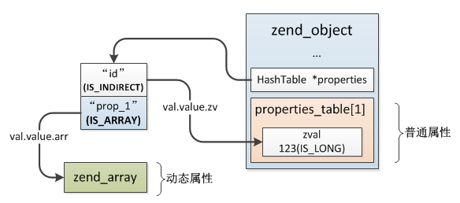

### 3.4.4 动态属性
前面介绍的成员属性都是在类中明确的定义过的，这些属性在实例化时会被拷贝到对象空间中去，PHP中除了显示的在类中定义成员属性外，还可以动态的创建非静态成员属性，这种属性不需要在类中明确定义，可以直接通过：`$obj->property_name=xxx`、`$this->property_name = xxx`为对象设置一个属性，这种属性称之为动态属性，举个例子：
```php
class my_class {
    public $id = 123;

    public function test($name, $value){
        $this->$name = $value;
    }
}

$obj = new my_class;
$obj->test("prop_1", array(1,2,3));
//或者直接：
//$obj->prop_1 = array(1,2,3);

print_r($obj);
```
在`test()`方法中直接操作了没有定义的成员属性，上面的例子将输出：
```
my_class Object
(
    [id] => 123
    [prop_1] => Array
        (
             [0] => 1
             [1] => 2
             [2] => 3
        )
)
```
前面类、对象两节曾介绍，非静态成员属性值在实例化时保存到了对象中，属性的操作按照编译时按顺序编好的序号操作，各对象对其非静态成员属性的操作互不干扰，那么动态属性是在运行时创建的，它是如何存储的呢？

与普通非静态属性不同，动态创建的属性保存在`zend_object->properties`哈希表中，查找的时候首先按照普通属性在`zend_class_entry.properties_info`找，没有找到再去`zend_object->properties`继续查找。动态属性的创建过程(即：修改属性的操作)：
```c
//zend_object->handlers->write_property:
ZEND_API void zend_std_write_property(zval *object, zval *member, zval *value, void **cache_slot)
{
    ...
    zobj = Z_OBJ_P(object);
    //先在zend_class_entry.properties_info查找此属性
    property_offset = zend_get_property_offset(zobj->ce, Z_STR_P(member), (zobj->ce->__set != NULL), cache_slot);

    if (EXPECTED(property_offset != ZEND_WRONG_PROPERTY_OFFSET)) {
        if (EXPECTED(property_offset != ZEND_DYNAMIC_PROPERTY_OFFSET)) {
            //普通属性，直接根据根据属性ofsset取出属性值
        } else if (EXPECTED(zobj->properties != NULL)) { //有动态属性
            ...
            //从动态属性中查找
            if ((variable_ptr = zend_hash_find(zobj->properties, Z_STR_P(member))) != NULL) {
found:
                zend_assign_to_variable(variable_ptr, value, IS_CV);
                goto exit;
            }
        } 
    }
    
    if (zobj->ce->__set) {
        //定义了__set()魔法函数
    }else if (EXPECTED(property_offset != ZEND_WRONG_PROPERTY_OFFSET)){
        if (EXPECTED(property_offset != ZEND_DYNAMIC_PROPERTY_OFFSET)) {
            ...
        } else {
            //首次创建动态属性将在这里完成
            if (!zobj->properties) {
                rebuild_object_properties(zobj);
            }
            //将动态属性插入properties
            zend_hash_add_new(zobj->properties, Z_STR_P(member), value);
        }
    }
}
```
上面就是成员属性的修改过程，普通属性根据其offset再从对象中取出属性值进行修改，而首次创建动态属性将通过`rebuild_object_properties()`初始化`zend_object->properties`哈希表，后面再创建动态属性直接插入此哈希表，`rebuild_object_properties()`过程并不仅仅是创建一个HashTable，还会将普通成员属性值插入到这个数组中，与动态属性不同，这里的插入并不是增加原zend_value的refcount，而是创建了一个IS_INDIRECT类型的zval，指向原属性值zval，具体结构如下图。



> 这里不清楚将原有属性也插入properties的用意，已知用到的一个地方是在GC垃圾回收获取对象所有属性时(zend_std_get_gc())，如果有动态属性则直接返回properties给GC遍历，假如不把普通的显式定义的属性"拷贝"进来则需要返回、遍历两个数组。
>
> 另外一个地方需要注意，把原属性"转移"到properties并不仅仅是创建动态属性时触发的，调用对象的get_properties(即：zend_std_get_properties())也会这么处理，比如将一个object转为array时就会触发这个动作: $arr = (array)$object;

成员属性的读取通过`zend_object->handlers->read_property`(默认zend_std_read_property())函数完成，动态属性的查找过程实际与`write_property`中相同：
```c
zval *zend_std_read_property(zval *object, zval *member, int type, void **cache_slot, zval *rv)
{
    ...
    zobj = Z_OBJ_P(object);

    //首先查找zend_class_entry.properties_info，普通属性可以在这里找到
    property_offset = zend_get_property_offset(zobj->ce, Z_STR_P(member), (type == BP_VAR_IS) || (zobj->ce->__get != NULL), cache_slot);

    if (EXPECTED(property_offset != ZEND_WRONG_PROPERTY_OFFSET)) {
        if (EXPECTED(property_offset != ZEND_DYNAMIC_PROPERTY_OFFSET)) {
            //普通属性
            retval = OBJ_PROP(zobj, property_offset);
        } else if (EXPECTED(zobj->properties != NULL)) {
            //动态属性从zend_object->properties中查找
            retval = zend_hash_find(zobj->properties, Z_STR_P(member));
            if (EXPECTED(retval)) goto exit;
        }
    }
    ...
}
```
