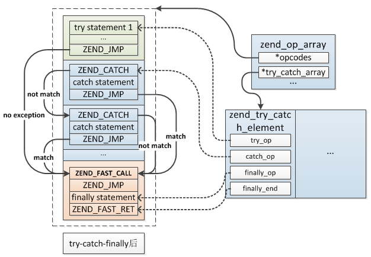

## 4.6 异常处理
PHP的异常处理与其它语言的类似，在程序中可以抛出、捕获一个异常，异常抛出必须只有定义在try{...}块中才可以被捕获，捕获以后将跳到catch块中进行处理，不再执行try中抛出异常之后的代码。

异常可以在任意位置抛出，然后将由最近的一个try所捕获，如果在当前执行空间没有进行捕获，那么将调用栈一直往上抛，比如在一个函数内部抛出一个异常，但是函数内没有进行try，而在函数调用的位置try了，那么就由调用处的catch捕获。

接下来我们从两个方面介绍下PHP异常处理的实现。

### 4.6.1 异常处理的编译
异常捕获及处理的语法：
```php
try{
    try statement;
}catch(exception_class_1 $e){
    catch statement 1;
}catch(exception_class_2 $e){
    catch statement 2;
}finally{
    finally statement;
}
```
抛出异常的语法：
```php
throw exception_object;
```
try表示要捕获try statement中可能抛出的异常；catch是捕获到异常后的处理，可以定义多个，当try中抛出异常时会依次检查各个catch的异常类是否与抛出的匹配，如果匹配则有命中的那个catch块处理；finally为最后执行的代码，不管是否有异常抛出都会执行。

语法规则：
```c
statement:
    ...
    |   T_TRY '{' inner_statement_list '}' catch_list finally_statement
            { $$ = zend_ast_create(ZEND_AST_TRY, $3, $5, $6); }
    ...
;
catch_list:
        /* empty */
            { $$ = zend_ast_create_list(0, ZEND_AST_CATCH_LIST); }
    |   catch_list T_CATCH '(' name T_VARIABLE ')' '{' inner_statement_list '}'
            { $$ = zend_ast_list_add($1, zend_ast_create(ZEND_AST_CATCH, $4, $5, $8)); }
;
finally_statement:
        /* empty */ { $$ = NULL; }
    |   T_FINALLY '{' inner_statement_list '}' { $$ = $3; }
;
```
从语法规则可以看出，try-catch-finally最终编译为一个`ZEND_AST_TRY`节点，包含三个子节点，分别是：try statement、catch list、finally statement，try statement、finally statement就是普通的`ZEND_AST_STMT_LIST`节点，catch list包含多个`ZEND_AST_CATCH`节点，每个节点有三个子节点：exception class、exception object及catch statement，最终生成的AST：


具体的编译过程如下：

* (1) 向所属zend_op_array注册一个zend_try_catch_element结构，所有try都会注册一个这样的结构，与循环结构注册的zend_brk_cont_element类似，当前zend_op_array所有定义的异常保存在zend_op_array->try_catch_array数组中，这个结构用来记录try、catch以及finally开始的位置，具体结构：
```c
typedef struct _zend_try_catch_element {
    uint32_t try_op;     //try开始的opcode位置
    uint32_t catch_op;   //第1个catch块的opcode位置
    uint32_t finally_op; //finally开始的opcode位置
    uint32_t finally_end;//finally结束的opcode位置
} zend_try_catch_element;
```
* (2) 编译try statement，编译完以后如果定义了catch块则编译一条`ZEND_JMP`，此opcode的作用时当无异常抛出时跳过所有catch跳到finally或整个异常之外的，因为catch块是在try statement之后编译的，所以具体的跳转值目前还无法确定；

* (3) 依次编译各个catch块，如果没有定义则跳过此步骤，每个catch编译时首先编译一条`ZEND_CATCH`，此opcode保存着此catch的exception class、exception object以及下一个catch块开始的位置，编译第1个catch时将此opcode的位置记录在zend_try_catch_element.catch_op上，接着编译catch statement，最后编译一条`ZEND_JMP`(最后一个catch不需要)，此opcode的作用与步骤(2)的相同；

* (4) 将步骤(2)、步骤(3)中`ZEND_JMP`跳转值设置为finally第1条opcode或异常定义之外的代码，如果没有定义finally则结束编译，否则编译finally块，首先编译一条`ZEND_FAST_CALL`及`ZEND_JMP`，接着编译finally statement，最后编译一条`ZEND_FAST_RET`。

编译完以后的结构：




### 4.6.2 异常的抛出与捕获
