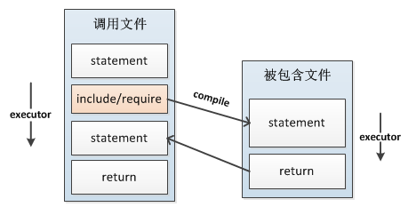
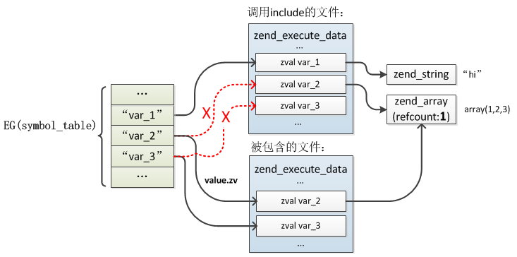
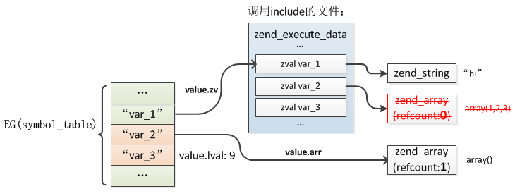

## 4.5 include/require
在实际应用中，我们不可能把所有的代码写到一个文件中，而是会按照一定的标准进行文件划分，include与require的功能就是将其他文件加载进来，比如在面向对象中通常会把一个类定义在单独文件中，使用时再include进来，类似其他语言的包的概念。

include与require没有本质上的区别，唯一的不同在于错误级别，当文件无法被正常加载时include会抛出warning警告，而require则会抛出error错误，本节下面的内容将以include说明。

在分析include的实现过程之前，首先要明确include的基本用法及特点：

* 被包含的文件将继承include所在行具有的全部变量范围，比如调用文件前面定义了一些变量，那么这些变量就能够在被包含的文件中使用，反之，被包含文件中定义的变量也将从include调用处开始可以被被调用文件所使用。
* 被包含文件中定义的函数、类在include执行之后将可以被随处使用，即具有全局作用域。
* include是在运行时加载文件并执行的，而不是在编译时。

这几个特性可以理解为include就是把其它文件的内容拷贝到了调用文件中，类似C语言中的宏(当然执行的时候并不是这样)，举个例子来说明：
```php
//a.php
$var_1 = "hi";
$var_2 = array(1,2,3);

include 'b.php';

var_dump($var_2);
var_dump($var_3);

//b.php
$var_2 = array();
$var_3 = 9;
```
执行`php a.php`结果显示$var_2值被修改为array()了，而include文件中新定义的$var_3也可以在调用文件中使用。

接下来我们就以这个例子详细介绍下include具体是如何实现的。


前面我们曾介绍过Zend引擎的编译、执行两个阶段(见上图)，整个过程的输入是一个文件，然后经过`PHP代码->AST->Opcodes->execute`一系列过程完成整个处理，编译过程的输入是一个文件，输出是zend_op_array，输出接着成为执行过程的输入，而include的处理实际就是这个过程，执行include时把被包含的文件像主脚本一样编译然后执行，接着在回到调用处继续执行。



include的编译过程非常简单，只编译为一条opcode：`ZEND_INCLUDE_OR_EVAL`，下面看下其具体处理过程：
```c
static ZEND_OPCODE_HANDLER_RET ZEND_FASTCALL ZEND_INCLUDE_OR_EVAL_SPEC_CONST_HANDLER(ZEND_OPCODE_HANDLER_ARGS)
{
    //include文件编译的zend_op_array
    zend_op_array *new_op_array=NULL;

    zval *inc_filename;
    zval tmp_inc_filename;
    zend_bool failure_retval=0;

    SAVE_OPLINE();
    inc_filename = EX_CONSTANT(opline->op1);
    ...

    switch (opline->extended_value) {
        ...
        case ZEND_INCLUDE:
        case ZEND_REQUIRE:
            //编译include的文件
            new_op_array = compile_filename(opline->extended_value, inc_filename);
            break;
        ...
    }
    ...
 
    zend_execute_data *call;   
    
    //分配运行时的zend_execute_data 
    call = zend_vm_stack_push_call_frame(ZEND_CALL_NESTED_CODE,
            (zend_function*)new_op_array, 0, EX(called_scope), Z_OBJ(EX(This)));

    //继承调用文件的全局变量符号表
    if (EX(symbol_table)) {
        call->symbol_table = EX(symbol_table);
    } else {
        call->symbol_table = zend_rebuild_symbol_table();
    }
    //保存当前zend_execute_data，include执行完再还原
    call->prev_execute_data = execute_data;
    //执行前初始化
    i_init_code_execute_data(call, new_op_array, return_value);
    //zend_execute_ex执行器入口，如果没有自定义这个函数则默认为execute_ex()
    if (EXPECTED(zend_execute_ex == execute_ex)) {
        //将执行器切到新的zend_execute_data，回忆下execute_ex()中的切换过程
        ZEND_VM_ENTER();
    }
    ...
}
```
整个过程比较容易理解，编译的过程不再重复，与之前介绍的没有差别；执行的过程实际非常像函数的调用过程，首先也是重新分配了一个zend_execute_data，然后将执行器切到新的zend_execute_data，执行完以后再切回调用处，如果include文件中只定义了函数、类，没有定义全局变量则执行过程实际直接执行return，只是在编译阶段将函数、类注册到EG(function_table)、EG(class_table)中了，这种情况比较简单，但是如果有全局变量定义处理就比较复杂了，比如上面那个例子，两个文件中都定义了全局变量，这些变量是如何被继承、合并的呢？

上面的过程中还有一个关键操作：`i_init_code_execute_data()`，关于这个函数在前面介绍`zend_execute()`时曾提过，这里面除了一些上下文的设置还会把当前zend_op_array下的变量移到EG(symbol_table)全局变量符号表中去，这些变量相对自己的作用域是局部变量，但它们定义在函数之外，实际也是全局变量，可以在函数中通过global访问，在执行前会把所有在php中定义的变量(zend_op_array->vars数组)插入EG(symbol_table)，value指向zend_execute_data局部变量的zval，如下图：


而include时也会执行这个步骤，如果发现var已经在EG(symbol_table)存在了，则会把value重新指向新的zval，也就是被包含文件的zend_execute_data的局部变量，同时会把原zval的value"拷贝"给新zval的value，概括一下就是被包含文件中的变量会继承、覆盖调用文件中的变量，这就是为什么被包含文件中可以直接使用调用文件中定义的变量的原因。被包含文件在`zend_attach_symbol_table()`完成以后EG(symbole_table)与zend_execute_data的关系：



> 注意：这里include文件中定义的var_1实际是替换了原文件中的变量，也就是只有一个var_1，所以此处zend_array的引用是1而不是2

接下来就是被包含文件的执行，执行到`$var_2 = array()`时，将原array(1,2,3)引用减1变为0，这时候将其释放，然后将新的value：array()赋给$var_2，这个过程就是普通变量的赋值过程，注意此时调用文件中的$var_2仍然指向被释放掉的value，此时的内存关系：


看到这里你可能会有一个疑问：$var_2既然被重新修改为新的一个值了，那么为什么调用文件中的$var_2仍然指向释放掉的value呢？include执行完成回到原来的调用文件中后为何可以读取到新的$var_2值以及新定义的var_3呢？答案在被包含文件执行完毕return的过程中。

被包含文件执行完以后最后执行return返回调用文件include的位置，return时会把***被包含文件中的***全局变量从zend_execute_data中移到EG(symbol_table)中，这里的移动是把value值更新到EG(symbol_table)，而不是像原来那样间接的指向value，这个操作在`zend_detach_symbol_table()`中完成，具体的return处理：
```c
static ZEND_OPCODE_HANDLER_RET ZEND_FASTCALL zend_leave_helper_SPEC(ZEND_OPCODE_HANDLER_ARGS)
{
    ...
    if (EXPECTED((ZEND_CALL_KIND_EX(call_info) & ZEND_CALL_TOP) == 0)) {
        //将include文件中定义的变量移到EG(symbol_table)
        zend_detach_symbol_table(execute_data);
        //释放zend_op_array
        destroy_op_array(&EX(func)->op_array);
        
        old_execute_data = execute_data;
        //切回调用文件的zend_execute_data
        execute_data = EG(current_execute_data) = EX(prev_execute_data);
        //释放include文件的zend_execute_data
        zend_vm_stack_free_call_frame_ex(call_info, old_execute_data);

        //重新attach
        zend_attach_symbol_table(execute_data);

        LOAD_NEXT_OPLINE();
        ZEND_VM_LEAVE();
    }else{
        //函数、主脚本返回的情况
    }
}
```
`zend_detach_symbol_table()`操作：
```c
ZEND_API void zend_detach_symbol_table(zend_execute_data *execute_data)
{   
    zend_op_array *op_array = &execute_data->func->op_array;
    HashTable *ht = execute_data->symbol_table;
    
    /* copy real values from CV slots into symbol table */
    if (EXPECTED(op_array->last_var)) {
        zend_string **str = op_array->vars;
        zend_string **end = str + op_array->last_var;
        zval *var = EX_VAR_NUM(0);
        
        do {
            if (Z_TYPE_P(var) == IS_UNDEF) {
                zend_hash_del(ht, *str);
            } else {
                zend_hash_update(ht, *str, var);
                ZVAL_UNDEF(var);
            }
            str++;
            var++;
        } while (str != end);
    }
}
```
完成以后EG(symbol_table)：



接着是还原调用文件的zend_execute_data，切回调用文件的include位置，在将执行器切回之前再次执行了`zend_attach_symbol_table()`，这时就会将原调用文件的变量重新插入全局变量符号表，插入$var_2、$var_3时发现已经存在了，则将局部变量区的$var_2、$var_3的value修改为这个值，这就是$var_2被include文件更新后覆盖原value的过程，同时$var_3也因为在调用文件中出现了所以值被修改为include中设定的值，此时的内存关系：


