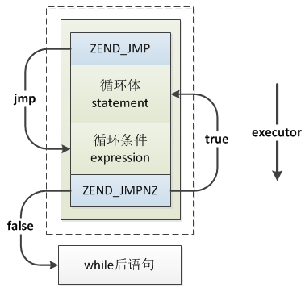
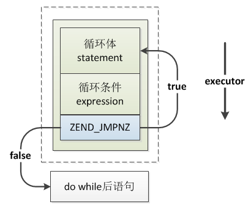
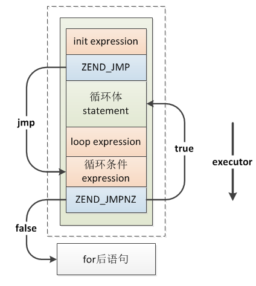
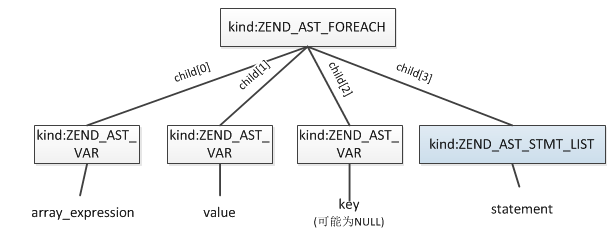
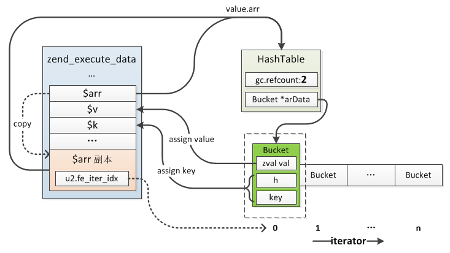
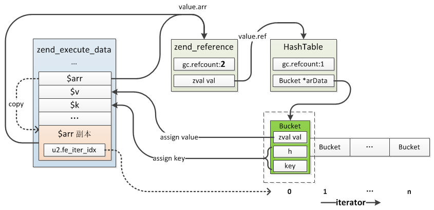
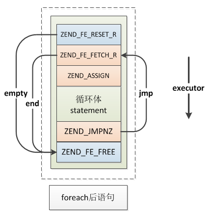

## 4.3 循环结构
实际应用中有许多具有规律性的重复操作，因此在程序中就需要重复执行某些语句。循环结构是在一定条件下反复执行某段程序的流程结构，被反复执行的程序被称为循环体。循环语句是由循环体及循环的终止条件两部分组成的。

PHP中的循环结构有4种：while、for、foreach、do while，接下来我们分析下这几个结构的具体的实现。

### 4.3.1 while循环
while循环的语法：
```php
while(expression) 
{
    statement;//循环体
} 
```
while的结构比较简单，由两部分组成：expression、statement，其中expression为循环判断条件，当expression为true时重复执行statement，具体的语法规则：
```c
statement:
    ...
    |   T_WHILE '(' expr ')' while_statement { $$ = zend_ast_create(ZEND_AST_WHILE, $3, $5); }
    ...
;

while_statement:
        statement { $$ = $1; }
    |   ':' inner_statement_list T_ENDWHILE ';' { $$ = $2; }
;
```
从while语法规则可以看出，在解析时会创建一个`ZEND_AST_WHILE`节点，expression、statement分别保存在两个子节点中，其AST如下：


while编译的过程也比较简单，比较特别的是while首先编译的是循环体，然后才是循环判断条件，更像是do while，编译过程大致如下：
* __(1)__ 首先编译一条ZEND_JMP的opcode，这条opcode用来跳到循环判断条件expression的位置，由于while是先编译循环体再编译循环条件，所以此时还无法确定具体的跳转值；
* __(2)__ 编译循环体statement；编译完成后更新步骤(1)中ZEND_JMP的跳转值；
* __(3)__ 编译循环判断条件expression；
* __(4)__ 编译一条ZEND_JMPNZ的opcode，这条opcode用于循环判断条件执行完以后跳到循环体的，如果循环条件成立则通过此opcode跳到循环体开始的位置，否则继续往下执行(即：跳出循环)。

具体的编译过程：
```c
void zend_compile_while(zend_ast *ast)
{   
    zend_ast *cond_ast = ast->child[0];
    zend_ast *stmt_ast = ast->child[1];
    znode cond_node;
    uint32_t opnum_start, opnum_jmp, opnum_cond;
    
    //(1)编译ZEND_JMP
    opnum_jmp = zend_emit_jump(0);
    
    //(2)编译循环体statement，opnum_start为循环体起始位置
    opnum_start = get_next_op_number(CG(active_op_array));
    zend_compile_stmt(stmt_ast);
    
    //设置ZEND_JMP opcode的跳转值
    opnum_cond = get_next_op_number(CG(active_op_array));
    zend_update_jump_target(opnum_jmp, opnum_cond);

    //(3)编译循环条件expression
    zend_compile_expr(&cond_node, cond_ast);
    
    //(4)编译ZEND_JMPNZ，用于循环条件成立时跳回循环体开始位置：opnum_start
    zend_emit_cond_jump(ZEND_JMPNZ, &cond_node, opnum_start);
}
```
编译后opcode整体如下：



运行时首先执行`ZEND_JMP`，跳到while条件expression处开始执行，然后由`ZEND_JMPNZ`对条件的执行结果进行判断，如果条件成立则跳到循环体statement起始位置开始执行，如果条件不成立则继续向下执行，跳出while，第一次循环执行以后将不再执行`ZEND_JMP`，后续循环只有靠`ZEND_JMPNZ`控制跳转，循环体执行完成后接着执行循环判断条件，进行下一轮循环的判断。

> __Note:__ 实际执行时可能会省略`ZEND_JMPNZ`这一步，这是因为很多while条件expression执行完以后会对下一条opcode进行判断，如果是`ZEND_JMPNZ`则直接根据条件成立与否进行快速跳转，不需要再由`ZEND_JMPNZ`判断，比如：
>
> $a = 123;
> while($a > 100){
>     echo "yes";
> }
> `$a > 100`对应的opcode：ZEND_IS_SMALLER，执行时发现$a与100类型可以直接比较(都是long)，则直接就能知道循环条件的判断结果，这种情况下将会判断下一条opcode是否为ZEND_JMPNZ，是的话直接设置下一条要执行的opcode，这样就不需要再单独执行依次ZEND_JMPNZ了。
> 
> 上面的例子如果`$a = '123';`就不会快速进行处理了，而是按照正常的逻辑调用ZEND_JMPNZ。

### 4.3.2 do while循环
do while与while非常相似，唯一的区别在于do while第一次执行时不需要判断循环条件。

do while循环的语法：
```php
do{
    statement;//循环体
}while(expression) 
```
do while编译过程与while的基本一致，不同的地方在于do while没有`ZEND_JMP`这条opcode：
```c
void zend_compile_do_while(zend_ast *ast)
{
    zend_ast *stmt_ast = ast->child[0];
    zend_ast *cond_ast = ast->child[1];

    znode cond_node;
    uint32_t opnum_start, opnum_cond;

    //(1)编译循环体statement，opnum_start为循环体起始位置
    opnum_start = get_next_op_number(CG(active_op_array));
    zend_compile_stmt(stmt_ast);

    //(2)编译循环判断条件expression
    opnum_cond = get_next_op_number(CG(active_op_array));
    zend_compile_expr(&cond_node, cond_ast);

    //(3)编译ZEND_JMPNZ
    zend_emit_cond_jump(ZEND_JMPNZ, &cond_node, opnum_start);
}
```
编译后的结果：



运行时首先执行循环体statement，然后执行循环判断条件，如果条件成立跳到循环体起始位置，否则结束循环。

### 4.3.3 for循环
for循环语法：
```php
for (init expr; condition expr; loop expr){
    statement
}
```
init expr在循环开始前无条件执行一次，后面循环不再执行；condition expr在每次循环开始前运算，是循环的判断条件，如果值为true，则继续循环，执行循环体，如果值为false，则终止循环；loop expr在每次循环体执行完以后被执行。

for的语法规则：
```c
statement:
    ...
    |   T_FOR '(' for_exprs ';' for_exprs ';' for_exprs ')' for_statement
            { $$ = zend_ast_create(ZEND_AST_FOR, $3, $5, $7, $9); }
    ...
;
```
从语法规则可以看出，for被编译为`ZEND_AST_FOR`节点，包含4个子节点，分别为：expr1、expr2、expr3、statement。


for的编译与while类似，只是多了init expr、loop expr两部分，编译过程大致如下：
* __(1)__ 首先编译初始化表达式：init expr;
* __(2)__ 编译一条`ZEND_JMP`的opcode，此opcode用于跳到条件expression位置，具体跳转值需要后面才能确定；
* __(3)__ 编译循环体statement；
* __(4)__ 编译loop expr；然后设置步骤(2)中`ZEND_JMP`的跳转值；
* __(5)__ 编译循环条件：condition expr；
* __(6)__ 编译一条`ZEND_JMPNZ`，此opcode用于循环条件成立时跳到循环体起始位置。

具体编译过程：
```c
void zend_compile_for(zend_ast *ast)
{
    zend_ast *init_ast = ast->child[0];
    zend_ast *cond_ast = ast->child[1];
    zend_ast *loop_ast = ast->child[2];
    zend_ast *stmt_ast = ast->child[3];

    znode result;
    uint32_t opnum_start, opnum_jmp, opnum_loop;

    //(1)编译init expression
    zend_compile_expr_list(&result, init_ast);
    zend_do_free(&result);

    //(2)编译ZEND_JMP
    opnum_jmp = zend_emit_jump(0);

    //opnum_start是循环体起始位置
    opnum_start = get_next_op_number(CG(active_op_array));
    
    //(3)编译循环体
    zend_compile_stmt(stmt_ast);

    //(4)编译loop expression
    opnum_loop = get_next_op_number(CG(active_op_array));
    zend_compile_expr_list(&result, loop_ast);
    zend_do_free(&result);
    
    //设置ZEND_JMP跳转值
    zend_update_jump_target_to_next(opnum_jmp);

    //(5)编译循环条件expression
    zend_compile_expr_list(&result, cond_ast);
    zend_do_extended_info();

    //(6)编译ZEND_JMPNZ
    zend_emit_cond_jump(ZEND_JMPNZ, &result, opnum_start);
}
```
最终编译结果：



运行时首先执行初始化表达式：init expression，然后执行`ZEND_JMP`跳到循环条件expression处，如果条件成立则执行`ZEND_JMPNZ`跳到循环体起始位置依次执行循环体、loop expression，如果条件不成立则终止循环，第一次循环之后就是：`循环条件->ZEND_JMPNZ->循环体->loop expression`之间循环了。

### 4.3.4 foreach循环
foreach是PHP针对数组、对象提供的一种遍历方式，foreach语法：
```php
foreach (array_expression as $key => $value){
    statement
}
```
遍历arraiy_expression时每次循环会把当前单元的值赋给$value，当前单元的键值赋给$key，其中$key可以省略，$value前也可以加"&"表示引用单元的值。

foreach的语法规则：
```c
statement:
    ...
    //省略key的规则: foreach($array as $v){ ... }
    |   T_FOREACH '(' expr T_AS foreach_variable ')' foreach_statement
            { $$ = zend_ast_create(ZEND_AST_FOREACH, $3, $5, NULL, $7); }
    //有key的规则: foreach($array as $k=>$v){ ... }
    |   T_FOREACH '(' expr T_AS foreach_variable T_DOUBLE_ARROW foreach_variable ')' foreach_statement
            { $$ = zend_ast_create(ZEND_AST_FOREACH, $3, $7, $5, $9); }
    ...
;
```
foreach在编译阶段解析为`ZEND_AST_FOREACH`节点，包含4个子节点，分别表示：遍历的数组或对象、遍历的value、遍历的key以及循环体，生成的AST类似这样：



如果value是指向数组或对象成员的引用，则value对应的节点类型为`ZEND_AST_REF`。

相对上面几种常规的循环结构，foreach的实现略显复杂：$key、$value实际就是两个普通的局部变量，遍历的过程就是对两个局部变量不断赋值、更新的过程，以数组为例，首先将数组拷贝一份用于遍历(只拷贝zval，value还是指向同一份)，从arData第一个元素开始，把Bucket.zval.value值赋值给$value，把Bucket.key(或Bucket.h)赋值给$key，然后更新迭代位置：将下一个元素的位置记录在`zval.u2.fe_iter_idx`中，这样下一轮遍历时直接从这个位置开始，这也是遍历前为什么要拷贝一份zval用于遍历的原因，如果发现`zval.u2.fe_iter_idx`已经到达arData末尾了则结束遍历，销毁一开始拷贝的zval。举个例子来看：

```php
$arr = array(1,2,3);
foreach($arr as $k=>$v){
    echo $v;
}
```
局部变量对应的内存结构：



如果value是引用则在循环前首先将原数组或对象重置为引用类型，然后新分配一个zval指向这个引用，后面的过程就与上面的一致了，仍以上面的例子为例，如果是:`foreach($arr as $k=>&$v){ ... }`则：



了解了foreach的实现、运行机制我们再回头看下其编译过程：

* __(1)__ 编译"拷贝"数组/对象操作的opcode：`ZEND_FE_RESET_R`，如果value是引用则是`ZEND_FE_RESET_RW`，执行时如果发现数组或对象属性为空则直接跳出遍历，所以这条opcode还需要知道跳出的位置，这个位置需要编译完foreach以后才能确定；
* __(2)__ 编译fetch数组/对象当前单元key、value的opcode：`ZEND_FE_FETCH_R`，如果是引用则是`ZEND_FE_FETCH_RW`，此opcode还需要知道当遍历已经到达数组末尾时跳出遍历的位置，与步骤(1)的opcode相同,另外还有一个关键操作，前面已经说过遍历的key、value实际就是普通的局部变量，它们的内存存储位置正是在这一步分配确定的，分配过程与普通局部变量的过程完全相同，如果value不是一个CV变量(比如：foreach($arr as $v["xx"]){...})则还会编译其它操作的opcode；
* __(3)__ 如果foreach定义了key则编译一条赋值opcode，此操作是对key进行赋值；
* __(4)__ 编译循环体statement；
* __(5)__ 编译跳回遍历开始位置的opcode：`ZEND_JMP`，一次遍历结束时会跳回步骤(2)编译的opcode处进行下次遍历；
* __(6)__ 设置步骤(1)、(2)两条opcode跳过的opcode数；
* __(7)__ 编译`ZEND_FE_FREE`，此操作用于释放步骤(1)"拷贝"的数组。

最终编译后的结构：



运行时的步骤：
* __(1)__ 执行`ZEND_FE_RESET_R`，过程上面已经介绍了；
* __(2)__ 执行`ZEND_FE_FETCH_R`，此opcode的操作主要有三个：检查遍历位置是否到达末尾、将数组元素的value赋值给$value、将数组元素的key赋值给一个临时变量(注意与value不同)；
* __(3)__ 如果定义了key则执行`ZEND_ASSIGN`，将key的值从临时变量赋值给$key，否则跳到步骤(4)；
* __(4)__ 执行循环体的statement；
* __(5)__ 执行`ZEND_JMPNZ`跳回步骤(2)；
* __(6)__ 遍历结束后执行`ZEND_FE_FREE`释放数组。

PHP中还有几个与遍历相关的函数：

* current() - 返回数组中的当前单元
* each() - 返回数组中当前的键／值对并将数组指针向前移动一步
* end() - 将数组的内部指针指向最后一个单元
* next() - 将数组中的内部指针向前移动一位
* prev() - 将数组的内部指针倒回一位


