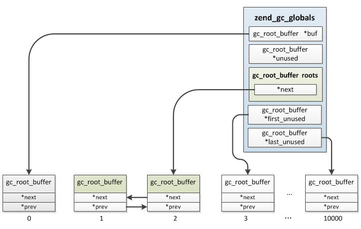
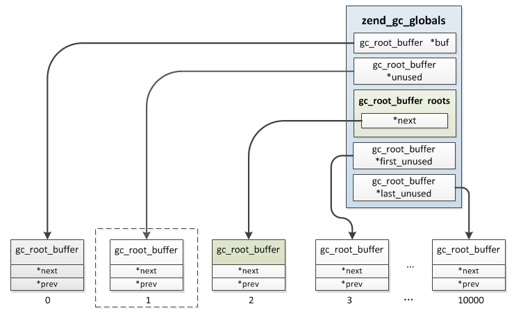

## 5.3 垃圾回收

### 5.3.1 垃圾的产生
前面已经介绍过PHP变量的内存管理，即引用计数机制，当变量赋值、传递时并不会直接硬拷贝，而是增加value的引用数，unset、return等释放变量时再减掉引用数，减掉后如果发现refcount变为0则直接释放value，这是变量的基本gc过程，PHP正是通过这个机制实现的自动垃圾回收，但是有一种情况是这个机制无法解决的，从而因变量无法回收导致内存始终得不到释放，这种情况就是循环引用，简单的描述就是变量的内部成员引用了变量自身，比如数组中的某个元素指向了数组，这样数组的引用计数中就有一个来自自身成员，试图释放数组时因为其refcount仍然大于0而得不到释放，而实际上已经没有任何外部引用了，这种变量不可能再被使用，所以PHP引入了另外一个机制用来处理变量循环引用的问题。

下面看一个数组循环引用的例子：
```php
$a = [1];
$a[] = &$a;

unset($a);
```
`unset($a)`之前引用关系：


注意这里$a的类型在`&`操作后已经转为引用，`unset($a)`之后：


可以看到，`unset($a)`之后由于数组中有子元素指向`$a`，所以`refcount = 1`，此时是无法通过正常的gc机制回收的，但是$a已经已经没有任何外部引用了，所以这种变量就是垃圾，垃圾回收器要处理的就是这种情况，这里明确两个准则：

>> 1) 如果一个变量value的refcount减少到0， 那么此value可以被释放掉，不属于垃圾

>> 2) 如果一个变量value的refcount减少之后大于0，那么此zval还不能被释放，此zval可能成为一个垃圾

针对第一个情况GC不会处理，只有第二种情况GC才会将变量收集起来。另外变量是否加入垃圾检查buffer并不是根据zval的类型判断的，而是与前面介绍的是否用到引用计数一样通过`zval.u1.type_flag`记录的，只有包含`IS_TYPE_COLLECTABLE`的变量才会被GC收集。

目前垃圾只会出现在array、object两种类型中，数组的情况上面已经介绍了，object的情况则是成员属性引用对象本身导致的，其它类型不会出现这种变量中的成员引用变量自身的情况，所以垃圾回收只会处理这两种类型的变量。
```c
#define IS_TYPE_COLLECTABLE
```
```c
|     type       | collectable |
+----------------+-------------+
|simple types    |             |
|string          |             |
|interned string |             |
|array           |      Y      |
|immutable array |             |
|object          |      Y      |
|resource        |             |
|reference       |             |
```
### 5.3.2 回收过程
如果当变量的refcount减少后大于0，PHP并不会立即进行对这个变量进行垃圾鉴定，而是放入一个缓冲buffer中，等这个buffer满了以后(10000个值)再统一进行处理，加入buffer的是变量zend_value的`zend_refcounted_h`:
```c
typedef struct _zend_refcounted_h {
    uint32_t         refcount; //记录zend_value的引用数
    union {
        struct {
            zend_uchar    type,  //zend_value的类型,与zval.u1.type一致
            zend_uchar    flags, 
            uint16_t      gc_info //GC信息，垃圾回收的过程会用到
        } v;
        uint32_t type_info;
    } u;
} zend_refcounted_h;
```

一个变量只能加入一次buffer，为了防止重复加入，变量加入后会把`zend_refcounted_h.gc_info`置为`GC_PURPLE`，即标为紫色，下次refcount减少时如果发现已经加入过了则不再重复插入。垃圾缓存区是一个双向链表，等到缓存区满了以后则启动垃圾检查过程：遍历缓存区，再对当前变量的所有成员进行遍历，然后把成员的refcount减1(如果成员还包含子成员则也进行递归遍历，其实就是深度优先的遍历)，最后再检查当前变量的引用，如果减为了0则为垃圾。这个算法的原理很简单，垃圾是由于成员引用自身导致的，那么就对所有的成员减一遍引用，结果如果发现变量本身refcount变为了0则就表明其引用全部来自自身成员。具体的过程如下：

(1) 从buffer链表的roots开始遍历，把当前value标为灰色(zend_refcounted_h.gc_info置为GC_GREY)，然后对当前value的成员进行深度优先遍历，把成员value的refcount减1，并且也标为灰色；

(2) 重复遍历buffer链表，检查当前value引用是否为0，为0则表示确实是垃圾，把它标为白色(GC_WHITE)，如果不为0则排除了引用全部来自自身成员的可能，表示还有外部的引用，并不是垃圾，这时候因为步骤(1)对成员进行了refcount减1操作，需要再还原回去，对所有成员进行深度遍历，把成员refcount加1，同时标为黑色；

(3) 再次遍历buffer链表，将非GC_WHITE的节点从roots链表中删除，最终roots链表中全部为真正的垃圾，最后将这些垃圾清除。


### 5.3.3 垃圾收集的内部实现
接下来我们简单看下垃圾回收的内部实现，垃圾收集器的全局数据结构：
```c
typedef struct _zend_gc_globals {
    zend_bool         gc_enabled; //是否启用gc
    zend_bool         gc_active;  //是否在垃圾检查过程中
    zend_bool         gc_full;    //缓存区是否已满

    gc_root_buffer   *buf;   //启动时分配的用于保存可能垃圾的缓存区
    gc_root_buffer    roots; //指向buf中最新加入的一个可能垃圾
    gc_root_buffer   *unused;//指向buf中没有使用的buffer
    gc_root_buffer   *first_unused; //指向buf中第一个没有使用的buffer
    gc_root_buffer   *last_unused; //指向buf尾部

    gc_root_buffer    to_free;  //待释放的垃圾
    gc_root_buffer   *next_to_free;

    uint32_t gc_runs;   //统计gc运行次数
    uint32_t collected; //统计已回收的垃圾数
} zend_gc_globals;

typedef struct _gc_root_buffer {
    zend_refcounted          *ref; //每个zend_value的gc信息
    struct _gc_root_buffer   *next;
    struct _gc_root_buffer   *prev;
    uint32_t                 refcount;
} gc_root_buffer;
```
`zend_gc_globals`是垃圾回收过程中主要用到的一个结构，用来保存垃圾回收器的所有信息，比如垃圾缓存区；`gc_root_buffer`用来保存每个可能是垃圾的变量，它实际就是整个垃圾收集buffer链表的元素，当GC收集一个变量时会创建一个`gc_root_buffer`，插入链表。

`zend_gc_globals`这个结构中有几个关键成员：

* __(1)buf:__ 前面已经说过，当refcount减少后如果大于0那么就会将这个变量的value加入GC的垃圾缓存区，buf就是这个缓存区，它实际是一块连续的内存，在GC初始化时一次性分配了10001个gc_root_buffer，插入变量时直接从buf中取出可用节点；
* __(2)roots:__ 垃圾缓存链表的头部，启动GC检查的过程就是从roots开始遍历的；
* __(3)first_unused:__ 指向buf中第一个可用的节点，初始化时这个值为1而不是0，因为第一个gc_root_buffer保留没有使用，有元素插入roots时如果first_unused还没有到达buf的尾部则返回first_unused给最新的元素，然后first_unused++，直到last_unused，比如现在已经加入了2个可能的垃圾变量，则对应的结构：



* __(4)last_unused:__ 与first_unused类似，指向buf末尾
* __(5)unused:__ GC收集变量时会依次从buf中获取可用的gc_root_buffer，这种情况直接取first_unused即可，但是有些变量加入垃圾缓存区之后其refcount又减为0了，这种情况就需要从roots中删掉，因为它不可能是垃圾，这样就导致roots链表并不是像buf分配的那样是连续的，中间会出现一些开始加入后面又删除的节点，这些节点就通过unused串成一个单链表，unused指向链表尾部，下次有新的变量插入roots时优先使用unused的这些节点，其次才是first_unused的，举个例子：
```php
//示例1：
$a = array(); //$a ->  zend_array(refcount=1)
$b = $a;      //$a ->  zend_array(refcount=2)
              //$b ->

unset($b);    //此时zend_array(refcount=1)，因为refoucnt>0所以加入gc的垃圾缓存区：roots
unset($a);    //此时zend_array(refcount=0)且gc_info为GC_PURPLE，则从roots链表中删掉
```
假如`unset($b)`时插入的是buf中第1个位置，那么`unset($a)`后对应的结构：



如果后面再有变量加入GC垃圾缓存区将优先使用第1个。

此GC机制可以通过php.ini中`zend.enable_gc`设置是否开启，如果开启则在php.ini解析后调用`gc_init()`进行GC初始化：
```c
ZEND_API void gc_init(void)
{
    if (GC_G(buf) == NULL && GC_G(gc_enabled)) {
        //分配buf缓存区内存，大小为GC_ROOT_BUFFER_MAX_ENTRIES(10001)，其中第1个保留不被使用
        GC_G(buf) = (gc_root_buffer*) malloc(sizeof(gc_root_buffer) * GC_ROOT_BUFFER_MAX_ENTRIES);
        GC_G(last_unused) = &GC_G(buf)[GC_ROOT_BUFFER_MAX_ENTRIES];
        //进行GC_G的初始化，其中：GC_G(first_unused) = GC_G(buf) + 1;从第2个开始的，第1个保留
        gc_reset();
    }
}
```
在PHP的执行过程中，如果发现array、object减掉refcount后大于0则会调用`gc_possible_root()`将zend_value的gc头部加入GC垃圾缓存区：
```c
ZEND_API void ZEND_FASTCALL gc_possible_root(zend_refcounted *ref)
{
    gc_root_buffer *newRoot;

    //插入的节点必须是GC_BLACK，防止重复插入
    ZEND_ASSERT(EXPECTED(GC_REF_GET_COLOR(ref) == GC_BLACK));

    newRoot = GC_G(unused); //先看下unused中有没有可用的
    if (newRoot) {
        //有的话先用unused的，然后将GC_G(unused)指向单链表的下一个
        GC_G(unused) = newRoot->prev;
    } else if (GC_G(first_unused) != GC_G(last_unused)) {
        //unused没有可用的，且buf中还有可用的
        newRoot = GC_G(first_unused);
        GC_G(first_unused)++;
    } else {
        //buf缓存区已满，这时需要启动垃圾检查程序了，遍历roots，将真正的垃圾释放
        //垃圾回收的动作就是在这触发的
        if (!GC_G(gc_enabled)) {
            return;
        }
        ...

        //启动垃圾回收过程
        gc_collect_cycles(); //即：zend_gc_collect_cycles()
        ...
    } 

    //将插入的ref标为紫色，防止重复插入
    GC_TRACE_SET_COLOR(ref, GC_PURPLE);
    //注意：gc_info不仅仅只有颜色的信息，还会记录当前gc_root_buffer在整个buf中的位置
    //这样做的目的是可以直接根据zend_value的gc信息取到它的gc_root_buffer，便于进行删除操作
    GC_INFO(ref) = (newRoot - GC_G(buf)) | GC_PURPLE;
    newRoot->ref = ref;

    //GC_G(roots).next指向新插入的元素
    newRoot->next = GC_G(roots).next;
    newRoot->prev = &GC_G(roots);
    GC_G(roots).next->prev = newRoot;
    GC_G(roots).next = newRoot;
}
```
同一个zend_value只会插入一次，再次插入时如果发现其gc_info不是GC_BLACK则直接跳过。另外像上面示例1的情况，插入后如果后面发现其refcount减为0了则表明它可以直接被回收掉，这时需要把这个节点从roots链表中删除，删除的操作通过`GC_REMOVE_FROM_BUFFER()`宏操作：
```c
#define GC_REMOVE_FROM_BUFFER(p) do { \
    zend_refcounted *_p = (zend_refcounted*)(p); \
        if (GC_ADDRESS(GC_INFO(_p))) { \
            gc_remove_from_buffer(_p); \
        } \
} while (0)

ZEND_API void ZEND_FASTCALL gc_remove_from_buffer(zend_refcounted *ref)
{
    gc_root_buffer *root;

    //GC_ADDRESS就是获取节点在缓存区中的位置，因为删除时输入是zend_refcounted
    //而缓存链表的节点类型是gc_root_buffer
    root = GC_G(buf) + GC_ADDRESS(GC_INFO(ref));
    if (GC_REF_GET_COLOR(ref) != GC_BLACK) {
        GC_TRACE_SET_COLOR(ref, GC_PURPLE);
    }
    GC_INFO(ref) = 0;
    GC_REMOVE_FROM_ROOTS(root); //双向链表的删除操作
    ...
}
```
插入时如果发现垃圾缓存链表已经满了，则会启动垃圾回收过程：`zend_gc_collect_cycles()`，这个过程会对之前插入缓存区的变量进行判断是否是循环引用导致的真正的垃圾，如果是垃圾则会进行回收，回收的过程前面已经介绍过:
```c
ZEND_API int zend_gc_collect_cycles(void)
{
    ...
    //(1)遍历roots链表，对当前节点value的所有成员(如数组元素、成员属性)进行深度优先遍历把成员refcount减1
    gc_mark_roots();

    //(2)再次遍历roots链表，检查各节点当前refcount是否为0，是的话标为白色，表示是垃圾，不是的话需要对还原(1)，把refcount再加回去
    gc_scan_roots();

    //(3)将roots链表中的非白色节点删除，之后roots链表中全部是真正的垃圾，将垃圾链表转到to_free等待释放
    count = gc_collect_roots(&gc_flags, &additional_buffer);
    ...
    
    //(4)释放垃圾
    current = to_free.next;
    while (current != &to_free) {
        p = current->ref;
        GC_G(next_to_free) = current->next;
        if ((GC_TYPE(p) & GC_TYPE_MASK) == IS_OBJECT) {
            //调用free_obj释放对象
            obj->handlers->free_obj(obj);
            ...
        } else if ((GC_TYPE(p) & GC_TYPE_MASK) == IS_ARRAY) {
            //释放数组
            zend_array *arr = (zend_array*)p;

            GC_TYPE(arr) = IS_NULL;
            zend_hash_destroy(arr);
        }
        current = GC_G(next_to_free);
    }
    ...
}
```
各步骤具体的过程不再详细介绍，

