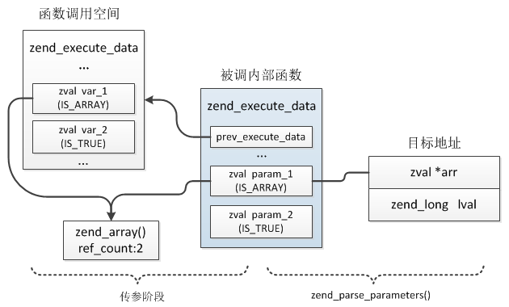

## 7.6 函数

### 7.6.1 内部函数
通过扩展可以将C语言实现的函数提供给PHP脚本使用，如同大量PHP内置函数一样，这些函数统称为内部函数(internal function)，与PHP脚本中定义的用户函数不同，它们无需经历用户函数的编译过程，同时执行时也不像用户函数那样每一个指令都调用一次C语言编写的handler函数，因此，内部函数的执行效率更高。除了性能上的优势，内部函数还可以拥有更高的控制权限，可发挥的作用也更大，能够完成很多用户函数无法实现的功能。

#### 7.6.1.1 内部函数的定义
前面介绍PHP函数的编译时曾经详细介绍过PHP函数的实现，函数通过`zend_function`来表示，这是一个联合体，用户函数使用`zend_function.op_array`，内部函数使用`zend_function.internal_function`，两者具有相同的头部用来记录函数的基本信息。不管是用户函数还是内部函数，其最终都被注册到EG(function_table)中，函数被调用时根据函数名称向这个符号表中查找。从内部函数的注册、使用过程可以看出，其定义实际非常简单，我们只需要定义一个`zend_internal_function`结构，然后注册到EG(function_table)中即可，接下来再重新看下内部函数的结构：
```c
typedef struct _zend_internal_function {
    /* Common elements */
    zend_uchar type;
    zend_uchar arg_flags[3]; /* bitset of arg_info.pass_by_reference */
    uint32_t fn_flags;
    zend_string* function_name;
    zend_class_entry *scope;
    zend_function *prototype;
    uint32_t num_args;
    uint32_t required_num_args;
    zend_internal_arg_info *arg_info;
    /* END of common elements */

    void (*handler)(INTERNAL_FUNCTION_PARAMETERS); //函数指针，展开：void (*handler)(zend_execute_data *execute_data, zval *return_value)
    struct _zend_module_entry *module;
    void *reserved[ZEND_MAX_RESERVED_RESOURCES];
} zend_internal_function;
```
Common elements就是与用户函数相同的头部，用来记录函数的基本信息：函数类型、参数信息、函数名等，handler是此内部函数的具体实现，PHP提供了一个宏用于此handler的定义：`PHP_FUNCTION(function_name)`或`ZEND_FUNCTION()`，展开后：
```c
void (*handler)(zend_execute_data *execute_data, zval *return_value)
```
也就是内部函数会得到两个参数：execute_data、return_value，execute_data不用再说了，return_value是函数的返回值，这两个值在扩展中会经常用到。

比如要在扩展中定义两个函数：my_func_1()、my_func_2()，首先是编写函数：
```c
PHP_FUNCTION(my_func_1)
{
    printf("Hello, I'm my_func_1\n");
}

PHP_FUNCTION(my_func_2)
{
    printf("Hello, I'm my_func_2\n");
}    
```
函数定义完了就需要向PHP注册了，这里并不需要扩展自己注册，PHP提供了一个内部函数注册结构：zend_function_entry，扩展只需要为每个内部函数生成这样一个结构，然后把它们保存到扩展`zend_module_entry.functions`即可，在加载扩展中会自动向EG(function_table)注册。
```c
typedef struct _zend_function_entry {
    const char *fname;  //函数名称
    void (*handler)(INTERNAL_FUNCTION_PARAMETERS); //handler实现
    const struct _zend_internal_arg_info *arg_info;//参数信息
    uint32_t num_args; //参数数目
    uint32_t flags;
} zend_function_entry;
```
zend_function_entry结构可以通过`PHP_FE()`或`ZEND_FE()`定义：
```c
const zend_function_entry mytest_functions[] = {
    PHP_FE(my_func_1,   NULL)
    PHP_FE(my_func_2,   NULL)
    PHP_FE_END //末尾必须加这个
};
```
这几个宏的定义为：
```c
#define ZEND_FE(name, arg_info)                     ZEND_FENTRY(name, ZEND_FN(name), arg_info, 0)
#define ZEND_FENTRY(zend_name, name, arg_info, flags)   { #zend_name, name, arg_info, (uint32_t) (sizeof(arg_info)/sizeof(struct _zend_internal_arg_info)-1), flags },
#define ZEND_FN(name) zif_##name
```
内部函数的名称前加了`zif_`前缀，以防与内核中的函数冲突，所以如果想用gdb调试扩展定义的函数记得加上这个前缀。最后将`zend_module_entry.functions`设置为`timeout_functions`即可：
```c
zend_module_entry mytest_module_entry = {
    STANDARD_MODULE_HEADER,
    "mytest",
    mytest_functions,
    NULL, //PHP_MINIT(mytest),
    NULL, //PHP_MSHUTDOWN(mytest),
    NULL, //PHP_RINIT(mytest),
    NULL, //PHP_RSHUTDOWN(mytest),
    NULL, //PHP_MINFO(mytest),
    "1.0.0",
    STANDARD_MODULE_PROPERTIES
};
```
下面来测试下这两个函数能否使用，编译安装后在PHP脚本中调用这两个函数：
```php
//test.php
my_func_1();
my_func_2();
```
cli模式下执行`php test.php`将输出：
```
Hello, I'm my_func_1
Hello, I'm my_func_2
```
大功告成，函数已经能够正常工作了，后续的工作就是不断完善handler实现扩展自己的功能了。

#### 7.6.1.2 函数参数解析
上面我们定义的函数没有接收任何参数，那么扩展定义的内部函数如何读取参数呢？首先回顾下函数参数的实现：用户自定义函数在编译时会为每个参数创建一个`zend_arg_info`结构，这个结构用来记录参数的名称、是否引用传参、是否为可变参数等，在存储上函数参数与局部变量相同，都分配在zend_execute_data上，且最先分配的就是函数参数，调用函数时首先会进行参数传递，按参数次序依次将参数的value从调用空间传递到被调函数的zend_execute_data，函数内部像访问普通局部变量一样通过存储位置访问参数，这是用户自定义函数的参数实现。

内部函数与用户自定义函数最大的不同在于内部函数就是一个普通的C函数，除函数参数以外在zend_execute_data上没有其他变量的分配，函数参数是从PHP用户空间传到函数的，它们与用户自定义函数完全相同，包括参数的分配方式、传参过程，也是按照参数次序依次分配在zend_execute_data上，所以在扩展中定义的函数直接按照顺序从zend_execute_data上读取对应的值即可，PHP中通过`zend_parse_parameters()`这个函数解析zend_execute_data上保存的参数：
```c
zend_parse_parameters(int num_args, const char *type_spec, ...);
```
num_args为实际传参数，通过`ZEND_NUM_ARGS()`获取；type_spec是一个字符串，用来标识解析参数的类型，比如:"la"表示第一个参数为整形，第二个为数组，将按照这个解析到指定变量；后面是一个可变参数，用来指定解析到的变量，这个值与type_spec配合使用，即type_spec用来指定解析的变量类型，可变参数用来指定要解析到的变量，这个值必须是指针。

解析的过程也比较容易理解，因为传给函数的参数已经保存到zend_execute_data上了，所以解析的过程就是按照type_spec指定的各个类型，依次从zend_execute_data上获取参数的value，然后保存到解析到的地址上，比如：
```c
PHP_FUNCTION(my_func_1)
{
    zend_long   lval;
    zval        *arr;
    
    if(zend_parse_parameters(ZEND_NUM_ARGS(), "la", &lval, &arr) == FAILURE){
        RETURN_FALSE;
    }
    ...
}
```
对应的内存关系：



注意：解析时除了整形、浮点型、布尔型和NULL是直接硬拷贝value外，其它解析到的变量只能是指针，arr为zend_execute_data上param_1的地址，即：`arr = &param_1`，所以图中arr、param_1之间用的不是箭头指向，也就是说参数始终存储在zend_execute_data上，内部函数要用只能从zend_execute_data上取。接下来详细介绍下`zend_parse_parameters()`不同类型的解析用法。

__(1)整形：l、L__

整形通过"l"、"L"标识，表示解析的参数为整形，解析到的变量类型必须是`zend_long`，不能解析其它类型，如果输入的参数不是整形将按照类型转换规则将其转为整形：
```c
zend_long   lval;

if(zend_parse_parameters(ZEND_NUM_ARGS(), "l", &lval){
    ...
}
printf("lval:%d\n", lval);
```
如果在标识符后加"!"，即："l!"、"L!"，则必须再提供一个zend_bool变量的地址，通过这个值可以判断传入的参数是否为NULL，如果为NULL则将要解析到的zend_long值设置为0，同时zend_bool设置为1：
```c
zend_long   lval; //如果参数为NULL则此值被设为0
zend_bool   is_null; //如果参数为NULL则此值为1，否则为0

if(zend_parse_parameters(ZEND_NUM_ARGS(), "l!", &lval, &is_null){
    ...
}
```
具体的解析过程：
```c
//zend_API.c #line:519
case 'l':
case 'L':
{
    //这里获取解析到的变量地址取的是zend_long *，所以只能解析到zend_long
    zend_long *p = va_arg(*va, zend_long *);
    zend_bool *is_null = NULL;
    
    //后面加"!"时check_null为1
    if (check_null) {
        is_null = va_arg(*va, zend_bool *);
    }

    if (!zend_parse_arg_long(arg, p, is_null, check_null, c == 'L')) {
        return "integer";
    }
}
```
```c
static zend_always_inline int zend_parse_arg_long(zval *arg, zend_long *dest, zend_bool *is_null, int check_null, int cap)
{
    if (check_null) {
        *is_null = 0;
    }
    if (EXPECTED(Z_TYPE_P(arg) == IS_LONG)) {
        //传参为整形，无需转化
        *dest = Z_LVAL_P(arg);
    } else if (check_null && Z_TYPE_P(arg) == IS_NULL) {
        //传参为NULL
        *is_null = 1;
        *dest = 0;
    } else if (cap) {
        //"L"的情况
        return zend_parse_arg_long_cap_slow(arg, dest);
    } else {
        //"l"的情况
        return zend_parse_arg_long_slow(arg, dest);
    }
    return 1;
}
```
> __Note:__ "l"与"L"的区别在于，当传参不是整形且转为整形后超过了整形的大小范围时，"L"将值调整为整形的最大或最小值，而"l"将报错，比如传的参数是字符串"9223372036854775808"，转整形后超过了unsigned int64的最大值：0xFFFFFFFFFFFFFFFF，"L"将解析为0xFFFFFFFFFFFFFFFF。

__(2)布尔型：b__

通过"b"标识符表示将传入的参数解析为布尔型，解析到的变量必须是zend_bool：
```c
zend_bool   ok;

if(zend_parse_parameters(ZEND_NUM_ARGS(), "b", &ok, &is_null) == FAILURE){
    ...
}
```
"b!"的用法与整形的完全相同，也必须再提供一个zend_bool的地址用于获取传参是否为NULL，如果为NULL，则zend_bool为0，用于获取是否NULL的zend_bool为1。

__(3)浮点型：d__

通过"d"标识符表示将参数解析为浮点型，解析的变量类型必须为double：
```c
double  dval;

if(zend_parse_parameters(ZEND_NUM_ARGS(), "d", &dval) == FAILURE){
    ...
}
```
具体解析过程不再展开，"d!"与整形、布尔型用法完全相同。

__(4)字符串：s、S、p、P__

字符串解析有两种形式：char*、zend_string，其中"s"将参数解析到`char*`，且需要额外提供一个size_t类型的变量用于获取字符串长度，"S"将解析到zend_string：
```c
char    *str;
size_t  str_len;

if(zend_parse_parameters(ZEND_NUM_ARGS(), "s", &str, &str_len) == FAILURE){
    ...
}
```
```c
zend_string    *str;

if(zend_parse_parameters(ZEND_NUM_ARGS(), "S", &str) == FAILURE){
    ...
}
```
"s!"、"S!"与整形、布尔型用法不同，字符串时不需要额外提供zend_bool的地址，如果参数为NULL，则char*、zend_string将设置为NULL。除了"s"、"S"之外还有两个类似的："p"、"P"，从解析规则来看主要用于解析路径，实际与普通字符串没什么区别，尚不清楚这俩有什么特殊用法。

__(5)数组：a、A、h、H__

数组的解析也有两类，一类是解析到zval层面，另一类是解析到HashTable，其中"a"、"A"解析到的变量必须是zval，"h"、"H"解析到HashTable，这两类是等价的：
```c
zval        *arr;   //必须是zval指针，不能是zval arr，因为参数保存在zend_execute_data上，arr为此空间上参数的地址
HashTable   *ht;

if(zend_parse_parameters(ZEND_NUM_ARGS(), "ah", &arr, &ht) == FAILURE){
    ...
} 
```
具体解析过程：
```c
case 'A':
case 'a':
{
    //解析到zval *
    zval **p = va_arg(*va, zval **);

    if (!zend_parse_arg_array(arg, p, check_null, c == 'A')) {
        return "array";
    }
}
break;

case 'H':
case 'h':
{
    //解析到HashTable *
    HashTable **p = va_arg(*va, HashTable **);

    if (!zend_parse_arg_array_ht(arg, p, check_null, c == 'H')) {
        return "array";
    }
}
break;
```
"a!"、"A!"、"h!"、"H!"的用法与字符串一致，也不需要额外提供别的地址，如果传参为NULL，则对应解析到的zval*、HashTable*也为NULL。
> __Note:__ 
>
> 1、"a"与"A"当传参为数组时没有任何差别，它们的区别在于：如果传参为对象"A"将按照对象解析到zval，而"a"将报错
>
> 2、"h"与"H"当传参为数组时同样没有差别，当传参为对象时，"H"将把对象的成员参数数组解析到目标变量，"h"将报错

__(6)对象：o、O__

如果参数是一个对象则可以通过"o"、"O"将其解析到目标变量，注意：只能解析为zval*，无法解析为zend_object*。
```c
zval    *obj;

if(zend_parse_parameters(ZEND_NUM_ARGS(), "o", &obj) == FAILURE){
    ...
}
```
"O"是要求解析指定类或其子类的对象，类似传参时显式的声明了参数类型的用法：`function my_func(MyClass $obj){...}`，如果参数不是指定类的实例化对象则无法解析。

"o!"、"O!"与字符串用法相同。

__(7)资源：r__

如果参数为资源则可以通过"r"获取其zval的地址，但是无法直接解析到zend_resource的地址，与对象相同。
```c
zval    *res;

if(zend_parse_parameters(ZEND_NUM_ARGS(), "r", &res) == FAILURE){
    ...
}
```
"r!"与字符串用法相同。

__(8)类：C__

如果参数是一个类则可以通过"C"解析出zend_class_entry地址：`function my_func(stdClass){...}`，这里有个地方比较特殊，解析到的变量可以设定为一个类，这种情况下解析时将会找到的类与指定的类之间的父子关系，只有存在父子关系才能解析，如果只是想根据参数获取类型的zend_class_entry地址，记得将解析到的地址初始化为NULL，否则将会不可预料的错误。
```c
zend_class_entry    *ce = NULL; //初始为NULL

if(zend_parse_parameters(ZEND_NUM_ARGS(), "C", &ce) == FAILURE){
    RETURN_FALSE;
}
```
__(9)通用解析：z__

"z"表示按参数实际类型解析，比如参数为字符串就解析为字符串，参数为数组就解析为数组，这种实际就是将zend_execute_data上的参数地址拷贝到目的变量了，没有做任何转化。

"z!"与字符串用法相同。

__(10)其它标识符__

#### 7.6.1.3 函数返回值

### 7.6.2 调用用户函数


