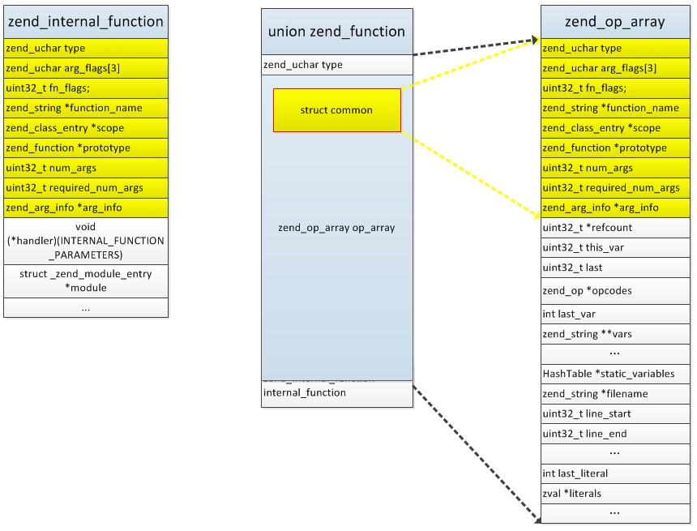

# 用户自定义函数的实现

函数，通俗的讲就是将一堆操作打包成一个黑盒，给予特定的输入将对应特定的输出。

汇编中函数对应的是一组独立的汇编指令，然后通过call指令实现函数的调用，前面已经说过PHP编译的结果是opcode数组，与汇编指令对应，PHP用户自定义函数的实现就是将函数编译为独立的opcode数组，调用时分配独立的执行栈依次执行opcode。


下面具体看下PHP中函数的结构：

```c
typedef union  _zend_function        zend_function;

//zend_compile.h
union _zend_function {
    zend_uchar type;    /* MUST be the first element of this struct! */

    struct {
        zend_uchar type;  /* never used */
        zend_uchar arg_flags[3]; /* bitset of arg_info.pass_by_reference */
        uint32_t fn_flags;
        zend_string *function_name;
        zend_class_entry *scope;
        union _zend_function *prototype;
        uint32_t num_args;
        uint32_t required_num_args;
        zend_arg_info *arg_info;
    } common;

    zend_op_array op_array;
    zend_internal_function internal_function;
};
```
这是一个union，因为PHP中函数分为两类：内部函数、用户自定义函数，内部函数是通过扩展或者内核提供的C函数，用户自定义函数就是我们在PHP中经常用到的function。

内部函数主要用到`internal_function`，而用户自定义函数编译完就是一个普通的opcode数组，因此是`op_array`，除了这两个上面还有一个`type`跟`common`，这俩是做什么用的呢？经过比较发现`zend_op_array`与`zend_internal_function`结构的起始位置都有`common`中的几个成员，如果你对C的内存比较了解应该会马上想到它们的用法，实际`common`可以看作是`op_array`、`internal_function`的header，不管是什么哪种函数都可以通过`zend_function.common.xx`快速访问到`zend_function.zend_op_array.xx`及`zend_function.zend_internal_function.xx`，下面几个，`type`同理，可以直接通过`zend_function.type`取到`zend_function.op_array.type`及`zend_function.internal_function.type`。



函数是在编译阶段确定的，那么它们存在哪呢？

在PHP脚本的生命周期中有一个非常重要的值`executor_globals`(非ZTS下)，类型是`struct _zend_executor_globals`，它记录着PHP生命周期中所有的数据，如果你写过PHP扩展一定用到过`EG`这个宏，这个宏实际就是对`executor_globals`的操作:`define EG(v) (executor_globals.v)`

`EG(function_table)`是一个哈希表，记录的就是PHP中所有的函数。

PHP在编译阶段将用户自定义的函数编译为独立的opcodes，保存在`EG(function_table)`中，调用时重新分配新的zend_execute_data(相当于运行栈)，然后执行函数的opcodes，调用完再还原到旧的`zend_execute_data`，继续执行，关于zend引擎execute阶段后面会详细分析。
