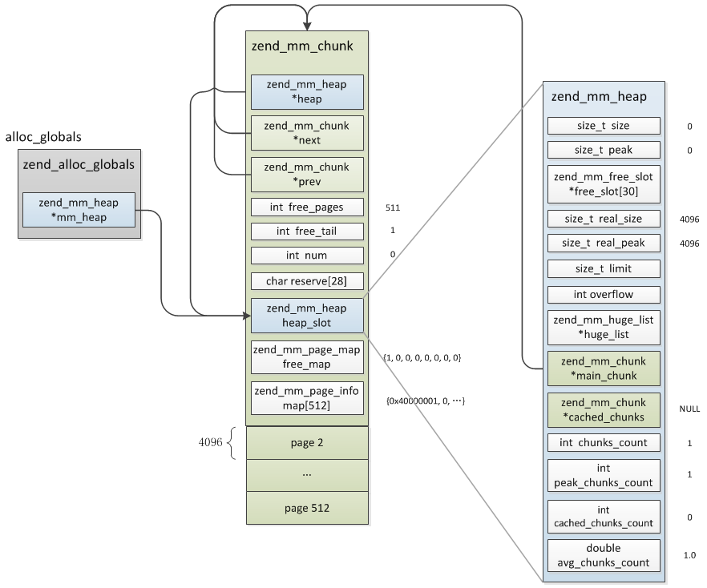

## 5.1 Zend内存池
zend针对内存的操作封装了一层，实现了更高效率的内存利用，其实现主要参考了tcmalloc的设计。

zend内存池有两种粒度的内存块：chunk、page，每个chunk的大小为2M，page大小为4KB，一个chunk被切割为512个page，申请内存时按照三种情况处理：
* __Huge:__ 申请内存大于2M，直接调用系统分配
* __Large:__ 申请内存大于3092B(3/4 page_size)，小于2044KB(511 page_size)，此时分配n个page大小的内存
* __Small:__ 申请内存小于3092B(3/4 page_size)，内存池提前定义好了30种同等大小的内存(8,16,24,32，...3072)，他们分配在不同的page上(不同大小的内存可能会分配在多个连续的page)，申请内存时直接在对应page上查找可用位置

chunk由512个page组成，其中第一个page用于保存chunk结构，剩下的511个page用于内存分配，page主要用于Large、Small两种内存的分配；heap是表示内存池的一个结构，它是最主要的一个结构，用于管理上面三种内存的分配。

heap、chunk的结构：
```c
struct _zend_mm_heap {
#if ZEND_MM_STAT
    size_t             size;                    /* current memory usage */
    size_t             peak;                    /* peak memory usage */
#endif
    zend_mm_free_slot *free_slot[ZEND_MM_BINS]; /* 小内存分配的可用位置链表，ZEND_MM_BINS等于30，即此数组表示的是各种大小内存对应的链表头部 */
#if ZEND_MM_STAT || ZEND_MM_LIMIT
    size_t             real_size;               /* current size of allocated pages */
#endif
#if ZEND_MM_STAT
    size_t             real_peak;               /* peak size of allocated pages */
#endif
#if ZEND_MM_LIMIT
    size_t             limit;                   /* memory limit */
    int                overflow;                /* memory overflow flag */
#endif

    zend_mm_huge_list *huge_list;               /* list of huge allocated blocks */

    zend_mm_chunk     *main_chunk;
    zend_mm_chunk     *cached_chunks;           /* list of unused chunks */
    int                chunks_count;            /* number of alocated chunks */
    int                peak_chunks_count;       /* peak number of allocated chunks for current request */
    int                cached_chunks_count;     /* number of cached chunks */
    double             avg_chunks_count;
}

struct _zend_mm_chunk {
    zend_mm_heap      *heap;
    zend_mm_chunk     *next;
    zend_mm_chunk     *prev;
    int                free_pages;              /* number of free pages */
    int                free_tail;               /* number of free pages at the end of chunk */
    int                num;
    char               reserve[64 - (sizeof(void*) * 3 + sizeof(int) * 3)];
    zend_mm_heap       heap_slot;               /* used only in main chunk */
    zend_mm_page_map   free_map;                /* 512 bits or 64 bytes */
    zend_mm_page_info  map[ZEND_MM_PAGES];      /* 2 KB = 512 * 4 */
};

struct _zend_mm_free_slot {
    zend_mm_free_slot *next_free_slot;
};
```

接下来看下内存池的初始化以及三种内存分配的过程。

### 5.1.1 内存池初始化
内存池在php_module_startup阶段初始化，start_memory_manager()：
```c
ZEND_API void start_memory_manager(void)
{
#ifdef ZTS
    ts_allocate_id(&alloc_globals_id, sizeof(zend_alloc_globals), (ts_allocate_ctor) alloc_globals_ctor, (ts_allocate_dtor) alloc_globals_dtor);
#else
    alloc_globals_ctor(&alloc_globals);
#endif
}

static void alloc_globals_ctor(zend_alloc_globals *alloc_globals)
{
#ifdef MAP_HUGETLB
    tmp = getenv("USE_ZEND_ALLOC_HUGE_PAGES");
    if (tmp && zend_atoi(tmp, 0)) {
        zend_mm_use_huge_pages = 1;
    }
#endif
    ZEND_TSRMLS_CACHE_UPDATE();
    alloc_globals->mm_heap = zend_mm_init();
}
```
__alloc_globals__是一个全局变量，即__AG宏__，它只有一个成员:mm_heap，保存着整个内存池的信息，所有内存的分配都是基于这个值，看下它的初始化：
```c
static zend_mm_heap *zend_mm_init(void)
{
    //向系统申请2M大小的chunk
    zend_mm_chunk *chunk = (zend_mm_chunk*)zend_mm_chunk_alloc_int(ZEND_MM_CHUNK_SIZE, ZEND_MM_CHUNK_SIZE);
    zend_mm_heap *heap;

    heap = &chunk->heap_slot;
    chunk->heap = heap;
    chunk->next = chunk;
    chunk->prev = chunk;
    chunk->free_pages = ZEND_MM_PAGES - ZEND_MM_FIRST_PAGE;
    chunk->free_tail = ZEND_MM_FIRST_PAGE;
    chunk->num = 0;
    chunk->free_map[0] = (Z_L(1) << ZEND_MM_FIRST_PAGE) - 1;
    chunk->map[0] = ZEND_MM_LRUN(ZEND_MM_FIRST_PAGE);
    heap->main_chunk = chunk;
    heap->cached_chunks = NULL;
    heap->chunks_count = 1;
    heap->peak_chunks_count = 1;
    heap->cached_chunks_count = 0;
    heap->avg_chunks_count = 1.0;
#if ZEND_MM_STAT || ZEND_MM_LIMIT
    heap->real_size = ZEND_MM_CHUNK_SIZE;
#endif
#if ZEND_MM_STAT
    heap->real_peak = ZEND_MM_CHUNK_SIZE;
    heap->size = 0;
    heap->peak = 0;
#endif
#if ZEND_MM_LIMIT
    heap->limit = (Z_L(-1) >> Z_L(1));
    heap->overflow = 0;
#endif
#if ZEND_MM_CUSTOM
    heap->use_custom_heap = ZEND_MM_CUSTOM_HEAP_NONE;
#endif
#if ZEND_MM_STORAGE
    heap->storage = NULL;
#endif
    heap->huge_list = NULL;
    return heap;
}
```
这里分配了主chunk，只有第一个chunk的heap会用到，后面分配的chunk不再用到heap，初始化完的结构如下图：



### 5.1.2 内存分配

#### 5.1.2.1 Huge分配
#### 5.1.2.2 Large分配
#### 5.1.2.3 Small分配

### 5.1.3 内存释放


