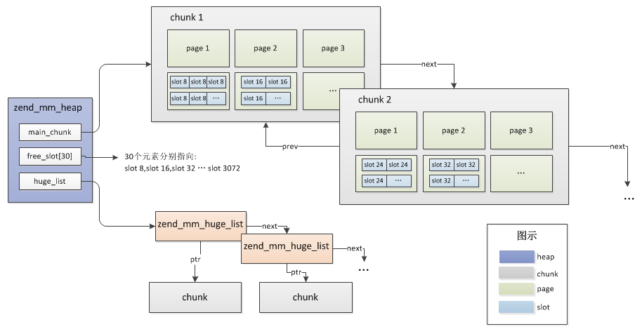
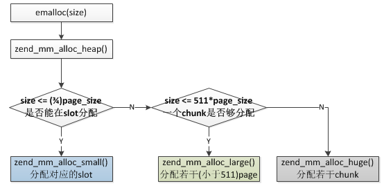
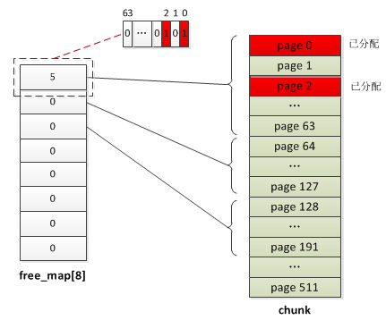
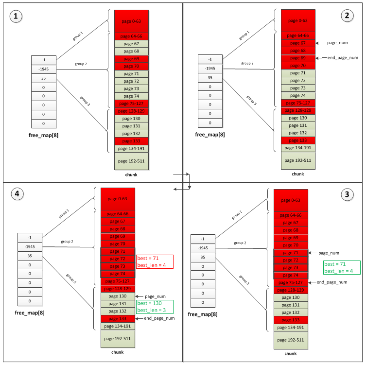
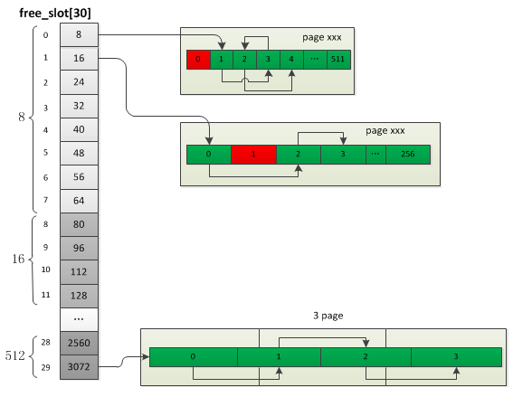

## 5.1 Zend内存池
zend针对内存的操作封装了一层，用于替换直接的内存操作：malloc、free等，实现了更高效率的内存利用，其实现主要参考了tcmalloc的设计。

源码中emalloc、efree、estrdup等等就是内存池的操作。

内存池是内核中最底层的内存操作，定义了三种粒度的内存块：chunk、page、slot，每个chunk的大小为2M，page大小为4KB，一个chunk被切割为512个page，而一个或若干个page被切割为多个slot，所以申请内存时按照不同的申请大小决定具体的分配策略：
* __Huge(chunk):__ 申请内存大于2M，直接调用系统分配，分配若干个chunk
* __Large(page):__ 申请内存大于3092B(3/4 page_size)，小于2044KB(511 page_size)，分配若干个page
* __Small(slot):__ 申请内存小于等于3092B(3/4 page_size)，内存池提前定义好了30种同等大小的内存(8,16,24,32，...3072)，他们分配在不同的page上(不同大小的内存可能会分配在多个连续的page)，申请内存时直接在对应page上查找可用位置

### 5.1.1 基本数据结构
chunk由512个page组成，其中第一个page用于保存chunk结构，剩下的511个page用于内存分配，page主要用于Large、Small两种内存的分配；heap是表示内存池的一个结构，它是最主要的一个结构，用于管理上面三种内存的分配，Zend中只有一个heap结构。

```c
struct _zend_mm_heap {
#if ZEND_MM_STAT
    size_t             size; //当前已用内存数
    size_t             peak; //内存单次申请的峰值
#endif
    zend_mm_free_slot *free_slot[ZEND_MM_BINS]; // 小内存分配的可用位置链表，ZEND_MM_BINS等于30，即此数组表示的是各种大小内存对应的链表头部
    ...

    zend_mm_huge_list *huge_list;               //大内存链表

    zend_mm_chunk     *main_chunk;              //指向chunk链表头部
    zend_mm_chunk     *cached_chunks;           //缓存的chunk链表
    int                chunks_count;            //已分配chunk数
    int                peak_chunks_count;       //当前request使用chunk峰值
    int                cached_chunks_count;     //缓存的chunk数
    double             avg_chunks_count;        //chunk使用均值，每次请求结束后会根据peak_chunks_count重新计算：(avg_chunks_count+peak_chunks_count)/2.0
}

struct _zend_mm_chunk {
    zend_mm_heap      *heap; //指向heap
    zend_mm_chunk     *next; //指向下一个chunk
    zend_mm_chunk     *prev; //指向上一个chunk
    int                free_pages; //当前chunk的剩余page数
    int                free_tail;               /* number of free pages at the end of chunk */
    int                num;
    char               reserve[64 - (sizeof(void*) * 3 + sizeof(int) * 3)];
    zend_mm_heap       heap_slot; //heap结构，只有主chunk会用到
    zend_mm_page_map   free_map; //标识各page是否已分配的数组，总大小512bit，对应page总数，每个page占一个bit位
    zend_mm_page_info  map[ZEND_MM_PAGES]; //各page的信息：当前page使用类型(用于large分配还是small)、占用的page数等
};

//按固定大小切好的small内存槽
struct _zend_mm_free_slot {
    zend_mm_free_slot *next_free_slot;//此指针只有内存未分配时用到，分配后整个结构体转为char使用
};
```
chunk、page、slot三者的关系：



接下来看下内存池的初始化以及三种内存分配的过程。

### 5.1.2 内存池初始化
内存池在php_module_startup阶段初始化，start_memory_manager()：
```c
ZEND_API void start_memory_manager(void)
{
#ifdef ZTS
    ts_allocate_id(&alloc_globals_id, sizeof(zend_alloc_globals), (ts_allocate_ctor) alloc_globals_ctor, (ts_allocate_dtor) alloc_globals_dtor);
#else
    alloc_globals_ctor(&alloc_globals);
#endif
}

static void alloc_globals_ctor(zend_alloc_globals *alloc_globals)
{
#ifdef MAP_HUGETLB
    tmp = getenv("USE_ZEND_ALLOC_HUGE_PAGES");
    if (tmp && zend_atoi(tmp, 0)) {
        zend_mm_use_huge_pages = 1;
    }
#endif
    ZEND_TSRMLS_CACHE_UPDATE();
    alloc_globals->mm_heap = zend_mm_init();
}
```
__alloc_globals__是一个全局变量，即__AG宏__，它只有一个成员:mm_heap，保存着整个内存池的信息，所有内存的分配都是基于这个值，多线程模式下(ZTS)会有多个heap，也就是说每个线程都有一个独立的内存池，看下它的初始化：
```c
static zend_mm_heap *zend_mm_init(void)
{
    //向系统申请2M大小的chunk
    zend_mm_chunk *chunk = (zend_mm_chunk*)zend_mm_chunk_alloc_int(ZEND_MM_CHUNK_SIZE, ZEND_MM_CHUNK_SIZE);
    zend_mm_heap *heap;

    heap = &chunk->heap_slot; //heap结构实际是主chunk嵌入的一个结构，后面再分配chunk的heap_slot不再使用
    chunk->heap = heap;
    chunk->next = chunk;
    chunk->prev = chunk;
    chunk->free_pages = ZEND_MM_PAGES - ZEND_MM_FIRST_PAGE; //剩余可用page数
    chunk->free_tail = ZEND_MM_FIRST_PAGE;
    chunk->num = 0;
    chunk->free_map[0] = (Z_L(1) << ZEND_MM_FIRST_PAGE) - 1; //将第一个page的bit分配标识位设置为1
    chunk->map[0] = ZEND_MM_LRUN(ZEND_MM_FIRST_PAGE); //第一个page的类型为ZEND_MM_IS_LRUN，即large内存
    heap->main_chunk = chunk; //指向主chunk
    heap->cached_chunks = NULL; //缓存chunk链表
    heap->chunks_count = 1; //已分配chunk数
    heap->peak_chunks_count = 1;
    heap->cached_chunks_count = 0;
    heap->avg_chunks_count = 1.0;
    ...
    heap->huge_list = NULL; //huge内存链表
    return heap;
}
```
这里分配了主chunk，只有第一个chunk的heap会用到，后面分配的chunk不再用到heap，初始化完的结构如下图：


初始化的过程实际只是分配了一个主chunk，这里并没有看到开始提到的小内存slot切割，下一节我们来详细看下各种内存的分配过程。

### 5.1.3 内存分配
文章开头已经简单提过Zend内存分配器按照申请内存的大小有三种不同的实现：



#### 5.1.3.1 Huge分配
超过2M内存的申请，与通用的内存申请没有太大差别，只是将申请的内存块通过单链表进行了管理。

```c
static void *zend_mm_alloc_huge(zend_mm_heap *heap, size_t size ZEND_FILE_LINE_DC ZEND_FILE_LINE_ORIG_DC)
{
    size_t new_size = ZEND_MM_ALIGNED_SIZE_EX(size, REAL_PAGE_SIZE); //按页大小重置实际要分配的内存

#if ZEND_MM_LIMIT
    //如果有内存使用限制则check是否已达上限，达到的话进行zend_mm_gc清理后再检查
    //此过程不再展开分析
#endif

    //分配chunk
    ptr = zend_mm_chunk_alloc(heap, new_size, ZEND_MM_CHUNK_SIZE);
    if (UNEXPECTED(ptr == NULL)) {
        //清理后再尝试分配一次
        if (zend_mm_gc(heap) &&
            (ptr = zend_mm_chunk_alloc(heap, new_size, ZEND_MM_CHUNK_SIZE)) != NULL) {
            /* pass */
        } else {
            //申请失败
            zend_mm_safe_error(heap, "Out of memory");
            return NULL;
        }
    }
    
    //将申请的内存通过zend_mm_huge_list插入到链表中,heap->huge_list指向的实际是zend_mm_huge_list
    zend_mm_add_huge_block(heap, ptr, new_size, ...);
    ...

    return ptr;
}
```
huge的分配过程还是比较简单的。

#### 5.1.3.2 Large分配
大于3/4的page_size(4KB)且小于等于511个page_size的内存申请，也就是一个chunk的大小够用(之所以是511个page而不是512个是因为第一个page始终被chunk结构占用)，__如果申请多个page的话 分配的时候这些page都是连续的__。

```c
static zend_always_inline void *zend_mm_alloc_large(zend_mm_heap *heap, size_t size ZEND_FILE_LINE_DC ZEND_FILE_LINE_ORIG_DC)
{
    //根据size大小计算需要分配多少个page
    int pages_count = (int)ZEND_MM_SIZE_TO_NUM(size, ZEND_MM_PAGE_SIZE);

    //分配pages_count个page
    void *ptr = zend_mm_alloc_pages(heap, pages_count, ...);
    
    ...

    return ptr;
}
```
进一步看下`zend_mm_alloc_pages`，这个过程比较复杂，简单描述的话就是从第一个chunk开始查找当前chunk下是否有pages_count个连续可用的page，有的话就停止查找，没有的话则接着查找下一个chunk，如果直到最后一个chunk也没找到则重新分配一个新的chunk并插入chunk链表，这个过程中最不好理解的一点在于如何查找pages_count个连续可用的page，这个主要根据__chunk->free_map__实现的，在看具体执行过程之前我们先解释下__free_map__的作用:

__我们已经知道每个chunk由512个page组成，而不管是large分配还是small分配，其分配的最小粒子都是page(small也是先分配1个或多个page然后再进行的切割)，所以需要有一个数组来记录每个page是否已经分配，free_map的作用就是标识当前chunk下各page的分配与否，比较特别的是free_map并不是512大小的数组，因为需要记录的信息非常简单，只需要一个bit位就够了，所以free_map就用`长整形`的各bit位来记录的，不同位数的机器长整形大小不同，因此在32、64位下16或8个长整形就够512bit了(每个byte等于8bit，长整形为4byte或8byte)，当然这么做并仅仅是节省空间，更重要的作用是可以提高查询效率__。

```c
typedef zend_ulong zend_mm_bitset;    /* 4-byte or 8-byte integer */
#define ZEND_MM_BITSET_LEN      (sizeof(zend_mm_bitset) * 8)       /* 32 or 64 */
#define ZEND_MM_PAGE_MAP_LEN    (ZEND_MM_PAGES / ZEND_MM_BITSET_LEN) /* 16 or 8 */

typedef zend_mm_bitset zend_mm_page_map[ZEND_MM_PAGE_MAP_LEN];     /* 64B */
```
`heap->free_map`实际就是：__zend_ulong free_map[16 or 8]__，以__free_map[8]__为例，数组中的8个数字分别表示：0-63、64-127、128-191、192-255、256-319、320-383、384-447、448-511 page的分配与否，比如当前chunk的page 0、page 2已经分配，则:`free_map[0] = 5`:
```
//5:
00000000 00000000 00000000 00000000 00000000 00000000 00000000 00000101
```


接下来看下`zend_mm_alloc_pages`的操作：
```c
static void *zend_mm_alloc_pages(zend_mm_heap *heap, int pages_count ZEND_FILE_LINE_DC ZEND_FILE_LINE_ORIG_DC)
{
    zend_mm_chunk *chunk = heap->main_chunk;
    int page_num, len;

    //从第一个chunk开始查找可用page
    while (1) {
        //当前chunk剩余page总数已不够
        if (UNEXPECTED(chunk->free_pages < pages_count)) {
            goto not_found;
        }else{ //查找当前chunk是否有pages_count个连续可用的page
            int best = -1; //已找到可用page起始页
            int best_len = ZEND_MM_PAGES; //已找到chunk的page间隙大小，这个值尽可能接近page_count
            int free_tail = chunk->free_tail;
            zend_mm_bitset *bitset = chunk->free_map;
            zend_mm_bitset tmp = *(bitset++); // zend_mm_bitset tmp = *bitset;  bitset++ 这里是复制出的，不会影响free_map
            int i = 0; 

            //下面就是查找最优page的过程,稍后详细分析
            //find best page
        }

not_found:
        if (chunk->next == heap->main_chunk) { //是否已到最后一个chunk
get_chunk:
            ...
        }else{
            chunk = chunk->next;
        }
    }

found: //找到可用page，page编号为page_num至(page_num + pages_count)
    /* mark run as allocated */
    chunk->free_pages -= pages_count;
    zend_mm_bitset_set_range(chunk->free_map, page_num, pages_count); //将page_num至(page_num + pages_count)page的bit标识位设置为已分配
    chunk->map[page_num] = ZEND_MM_LRUN(pages_count); //map为两个值的组合值，首先表示当前page属于哪种类型，其次表示包含的page页数
    if (page_num == chunk->free_tail) {
        chunk->free_tail = page_num + pages_count;
    }
    return ZEND_MM_PAGE_ADDR(chunk, page_num);
}
```
查找过程就是从第一个chunk开始搜索，如果当前chunk没有合适的则进入下一chunk，如果直到最后都没有找到则新创建一个chunk。

注意：查找page的过程并不仅仅是够数即可，这里有一个标准是：__申请的一个或多个的page要尽可能的填满chunk的空隙__，也就是说如果当前chunk有多块内存满足需求则会选择最合适的那块，而合适的标准前面提到的那个。

__最优page的检索过程__：

* __step1:__首先从第一个page分组(page 0-63)开始检查，如果当前分组无可用page(即free_map[x] = -1)则进入下一分组，直到当前分组有空闲page，然后进入step2
* __step2:__当前分组有可用page，首先找到第一个可用page的位置，记作page_num，接着__从page_num开始__向下找第一个已分配page的位置，记作end_page_num，这个地方需要注意，__如果当前分组剩下的page都是可用的则会进入下一分组接着搜索__，直到找到为止，这里还会借助chunk->free_tail避免无谓的查找到最后分组
* __step3:__根据上一步找到的page_num、end_page_num可计算得到当前可用内存块大小为len个page，然后与申请的page页数(page_count)比较
    * __step3.1:__如果len=page_count则表示找到的内存块符合申请条件且非常完美，直接从page_num开始分配page_count个page
    * __step3.2:__如果len>page_count则表示找到的内存块符合条件且空间很充裕，暂且记录下len、page_num，然后继续向下搜索，如果有更合适的则用更合适的替代
    * __step3.3:__如果len<page_count则表示当前内存块不够申请的大小，不符合条件，然后将这块空间的全部page设置为已分配(这样下一轮检索就不会再次找到它了)，接着从step1重新检索

下面从一个例子具体看下，以64bit整形为例，假如当前page分配情况如下图-(1)(group1全部已分配;group2中page 67-68、71-74未分配，其余都已分配;group3中除page 128-129、133已分配外其余都未分配)，现在要申请3个page：



检索过程：
* a.首先会直接跳过group1，直接到group2检索
* b.在group2中找到第一个可用page位置：67，然后向下找第一个不可用page位置：69，找到的可用内存块长度为2，小于3，表示此内存块不可用，这时会将page 67-68标识为已分配，图-(2)
* c.接着再次在group2中查找到第一个可用page位置：71,然后向下找到第一个不可用page位置：75,内存块长度为4，大于3，表示找到一个符合的位置，虽然已经找到可用内存块但并不"完美"，先将这个并不完美的page_num及len保存到best、best_len，如果后面没有比它更完美的就用它了，然后将page 71-74标示为已分配，图-(3)
* d.再次检索，发现group2已无可用page，进入group3，找到可用内存位置：page 130-132，大小比c中找到的合适，所以最终返回的page就是130-132，图-(4)

page分配完成后会将free_map对应整数的bit位从page_num至(page_num+page_count)置为1，同时将chunk->map[page_num]置为`ZEND_MM_LRUN(pages_count)`，表示page_num至(page_num+page_count)这些page是被Large分配占用的。

#### 5.1.3.3 Small分配
small内存指的是小于(3/4 page_size)的内存，这些内存首先也是申请了1个或多个page，然后再将这些page按固定大小切割了，所以第一步与上一节Large分配完全相同。

small内存总共有30种固定大小的规格：8,16,24,32,40,48,56,64,80,96,112,128 ... 1792,2048,2560,3072 Byte，我们把这称之为slot，这些slot的大小是有规律的:最小的slot大小为8byte，前8个slot__依次递增8byte__，后面每隔4个递增值乘以2，即`slot 0-7递增8byte、8-11递增16byte、12-15递增32byte、16-19递增32byte、20-23递增128byte、24-27递增256byte、28-29递增512byte`，每种大小的slot占用的page数分别是：slot 0-15各占1个page、slot 16-29依次占5, 3, 1, 1, 5, 3, 2, 2, 5, 3, 7, 4, 5, 3个page，这些值定义在`zend_alloc_sizes.h`中：

```c
/* num, size, count, pages */
#define ZEND_MM_BINS_INFO(_, x, y) \
    _( 0,    8,  512, 1, x, y) \ //四个值的含义依次是：slot编号、slot大小、slot数量、占用page数
    _( 1,   16,  256, 1, x, y) \
    _( 2,   24,  170, 1, x, y) \
    _( 3,   32,  128, 1, x, y) \
    _( 4,   40,  102, 1, x, y) \
    _( 5,   48,   85, 1, x, y) \
    _( 6,   56,   73, 1, x, y) \
    _( 7,   64,   64, 1, x, y) \
    _( 8,   80,   51, 1, x, y) \
    _( 9,   96,   42, 1, x, y) \
    _(10,  112,   36, 1, x, y) \
    _(11,  128,   32, 1, x, y) \
    _(12,  160,   25, 1, x, y) \
    _(13,  192,   21, 1, x, y) \
    _(14,  224,   18, 1, x, y) \
    _(15,  256,   16, 1, x, y) \
    _(16,  320,   64, 5, x, y) \
    _(17,  384,   32, 3, x, y) \
    _(18,  448,    9, 1, x, y) \
    _(19,  512,    8, 1, x, y) \
    _(20,  640,   32, 5, x, y) \
    _(21,  768,   16, 3, x, y) \
    _(22,  896,    9, 2, x, y) \
    _(23, 1024,    8, 2, x, y) \
    _(24, 1280,   16, 5, x, y) \
    _(25, 1536,    8, 3, x, y) \
    _(26, 1792,   16, 7, x, y) \
    _(27, 2048,    8, 4, x, y) \
    _(28, 2560,    8, 5, x, y) \
    _(29, 3072,    4, 3, x, y)
```
small内存的分配过程：

* __step1:__首先根据申请内存的大小在heap->free_slot中找到对应的slot规格bin_num，如果当前slot为空则首先分配对应的page，然后将这些page内存按slot大小切割为zend_mm_free_slot单向链表，free_slot[bin_num]始终指向第一个可用的slot
* __step2:__如果申请内存大小对应的的slot链表不为空则直接返回free_slot[bin_num]，然后将free_slot[bin_num]指向下一个空闲位置free_slot[bin_num]->next_free_slot
* __step3:__释放内存时先将此内存的next_free_slot指向free_slot[bin_num]，然后将free_slot[bin_num]指向释放的内存，也就是将释放的内存插到链表头部



### 5.1.4 系统内存分配
上面介绍了三种内存分配的过程，内存池实际只是在系统内存上面做了一些工作，尽可能减少系统内存的分配次数，接下来简单看下系统内存的分配。

chunk、page、slot三种内存粒度中chunk的分配是直接向系统申请的，这里调用的并不是malloc（这只是glibc实现的内存操作，并不是操作系统的，zend的内存池实际跟malloc的角色相同），而是mmap：
```c
static void *zend_mm_mmap(size_t size)
{
    ...

//hugepage支持
#ifdef MAP_HUGETLB
        if (zend_mm_use_huge_pages && size == ZEND_MM_CHUNK_SIZE) {
            ptr = mmap(NULL, size, PROT_READ | PROT_WRITE, MAP_PRIVATE | MAP_ANON | MAP_HUGETLB, -1, 0);
            if (ptr != MAP_FAILED) {
                return ptr;
            }
        }
#endif

    ptr = mmap(NULL, size, PROT_READ | PROT_WRITE, MAP_PRIVATE | MAP_ANON, -1, 0);

    if (ptr == MAP_FAILED) {
#if ZEND_MM_ERROR
        fprintf(stderr, "\nmmap() failed: [%d] %s\n", errno, strerror(errno));
#endif  
        return NULL;
    }
    return ptr;
}
```
HugePage的支持就是在这个地方提现的，详细的可以看下鸟哥的这篇文章：[http://www.laruence.com/2015/10/02/3069.html](http://www.laruence.com/2015/10/02/3069.html)。

『关于Hugepage是啥，简单的说下就是默认的内存是以4KB分页的，而虚拟地址和内存地址是需要转换的， 而这个转换是要查表的，CPU为了加速这个查表过程都会内建TLB（Translation Lookaside Buffer）， 显而易见如果虚拟页越小，表里的条目数也就越多，而TLB大小是有限的，条目数越多TLB的Cache Miss也就会越高， 所以如果我们能启用大内存页就能间接降低这个TLB Cache Miss』

### 5.1.5 内存释放
内存的释放主要是efree操作，与三种分配一一对应，过程也比较简单：
```c
#define efree(ptr)                          _efree((ptr) ZEND_FILE_LINE_CC ZEND_FILE_LINE_EMPTY_CC)
#define efree_large(ptr)                    _efree_large((ptr) ZEND_FILE_LINE_CC ZEND_FILE_LINE_EMPTY_CC)
#define efree_huge(ptr)                     _efree_huge((ptr) ZEND_FILE_LINE_CC ZEND_FILE_LINE_EMPTY_CC)

ZEND_API void ZEND_FASTCALL _efree(void *ptr ZEND_FILE_LINE_DC ZEND_FILE_LINE_ORIG_DC)
{
    zend_mm_free_heap(AG(mm_heap), ptr ZEND_FILE_LINE_RELAY_CC ZEND_FILE_LINE_ORIG_RELAY_CC);
}

static zend_always_inline void zend_mm_free_heap(zend_mm_heap *heap, void *ptr ZEND_FILE_LINE_DC ZEND_FILE_LINE_ORIG_DC)
{
    size_t page_offset = ZEND_MM_ALIGNED_OFFSET(ptr, ZEND_MM_CHUNK_SIZE); //根据内存地址及对齐值判断内存地址偏移量是否为0，是的话只有huge情况符合，page、slot分配出的内存地址偏移量一定是>=ZEND_MM_CHUNK_SIZE的，因为第一页始终被chunk自身结构占用，不可能分配出去

    if (UNEXPECTED(page_offset == 0)) {
        if (ptr != NULL) {
            //释放huge内存，从huge_list中删除
            zend_mm_free_huge(heap, ptr ZEND_FILE_LINE_RELAY_CC ZEND_FILE_LINE_ORIG_RELAY_CC);
        }
    } else { //page或slot，根据chunk->map[]值判断当前page的分配类型
        zend_mm_chunk *chunk = (zend_mm_chunk*)ZEND_MM_ALIGNED_BASE(ptr, ZEND_MM_CHUNK_SIZE);
        int page_num = (int)(page_offset / ZEND_MM_PAGE_SIZE);
        zend_mm_page_info info = chunk->map[page_num];

        ZEND_MM_CHECK(chunk->heap == heap, "zend_mm_heap corrupted");
        if (EXPECTED(info & ZEND_MM_IS_SRUN)) {
            zend_mm_free_small(heap, ptr, ZEND_MM_SRUN_BIN_NUM(info)); //slot的释放上一节已经介绍过，就是个普通的链表插入操作
        } else /* if (info & ZEND_MM_IS_LRUN) */ {
            int pages_count = ZEND_MM_LRUN_PAGES(info);

            ZEND_MM_CHECK(ZEND_MM_ALIGNED_OFFSET(page_offset, ZEND_MM_PAGE_SIZE) == 0, "zend_mm_heap corrupted");
            //释放page，将free_map中的标识位设置为未分配
            zend_mm_free_large(heap, chunk, page_num, pages_count);
        }
    }
}
```
释放page的过程有一个地方值得注意，如果释放后发现当前chunk所有page都已经被释放则可能会释放所在chunk，还记得heap->cached_chunks吗？内存池会维持一定的chunk数，每次释放并不会直接销毁而是加入到cached_chunks中，这样下次申请chunk时直接就用了，同时为了防止占用过多内存，cached_chunks会根据每次request请求计算的chunk使用均值保证其维持在一定范围内。

每次request请求结束会对内存池进行一次清理，检查cache的chunk数是否超过均值，超过的话就进行清理，具体的操作：`zend_mm_shutdown`，这里不再展开。


