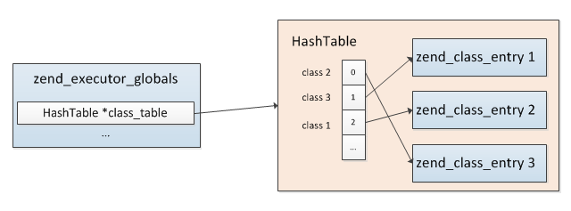

### 3.4.1 类
类是现实世界或思维世界中的实体在计算机中的反映，它将某些具有关联关系的数据以及这些数据上的操作封装在一起。在面向对象中类是对象的抽象，对象是类的具体实例。

在PHP中类编译阶段的产物，而对象是运行时产生的，它们归属于不同阶段。

PHP中我们这样定义一个类：
```php
class 类名 {
    常量;
    成员属性;
    成员方法;
}
```

一个类可以包含有属于自己的常量、变量（称为“属性”）以及函数（称为“方法”），本节将围绕这三部分具体弄清楚以下几个问题：

* a.类的存储及索引
* b.成员属性的存储结构
* c.成员方法的存储结构
* d.成员方法的调用过程及与普通function调用的差别

#### 3.4.1.1 类的结构及存储
首先我们看下类的数据结构：
```c
struct _zend_class_entry {
    char type;          //类的类型：内部类ZEND_INTERNAL_CLASS(1)、用户自定义类ZEND_USER_CLASS(2)
    zend_string *name;  //类名，PHP类不区分大小写，统一为小写
    struct _zend_class_entry *parent; //父类
    int refcount;
    uint32_t ce_flags;  //类掩码，如普通类、抽象类、接口，除了这还有别的含义，暂未弄清

    int default_properties_count;        //普通属性数，包括public、private
    int default_static_members_count;    //静态属性数，static
    zval *default_properties_table;      //普通属性值数组
    zval *default_static_members_table;  //静态属性值数组
    zval *static_members_table;
    HashTable function_table;  //成员方法哈希表
    HashTable properties_info; //成员属性基本信息哈希表，key为成员名，value为zend_property_info
    HashTable constants_table; //常量哈希表，通过constant定义的

    //以下是构造函授、析构函数、魔法函数的指针
    union _zend_function *constructor;
    union _zend_function *destructor;
    union _zend_function *clone;
    union _zend_function *__get;
    union _zend_function *__set;
    union _zend_function *__unset;
    union _zend_function *__isset;
    union _zend_function *__call;
    union _zend_function *__callstatic;
    union _zend_function *__tostring;
    union _zend_function *__debugInfo;
    union _zend_function *serialize_func;
    union _zend_function *unserialize_func;

    zend_class_iterator_funcs iterator_funcs;

    //下面这几个暂时忽略，后面碰到的时候再分析其作用
    /* handlers */
    zend_object* (*create_object)(zend_class_entry *class_type);
    zend_object_iterator *(*get_iterator)(zend_class_entry *ce, zval *object, int by_ref);
    int (*interface_gets_implemented)(zend_class_entry *iface, zend_class_entry *class_type); /* a class implements this interface */
    union _zend_function *(*get_static_method)(zend_class_entry *ce, zend_string* method);

    /* serializer callbacks */
    int (*serialize)(zval *object, unsigned char **buffer, size_t *buf_len, zend_serialize_data *data);
    int (*unserialize)(zval *object, zend_class_entry *ce, const unsigned char *buf, size_t buf_len, zend_unserialize_data *data);

    uint32_t num_interfaces; //实现的接口数
    uint32_t num_traits;
    zend_class_entry **interfaces; //实现的接口

    zend_class_entry **traits;
    zend_trait_alias **trait_aliases;
    zend_trait_precedence **trait_precedences;

    union {
        struct {
            zend_string *filename;
            uint32_t line_start;
            uint32_t line_end;
            zend_string *doc_comment;
        } user;
        struct {
            const struct _zend_function_entry *builtin_functions;
            struct _zend_module_entry *module; //所属扩展
        } internal;
    } info;
}
```
举个例子具体看下，定义一个User类，它继承了Human类，User类中有一个常量、一个静态属性、两个普通属性：
```php
//父类
class Human {}

class User extends Human
{
    const type = 110;

    static $name = "uuu";
    public $uid = 900;
    public $sex = 'w';

    public function __construct(){
    }

    public function getName(){
        return $this->name;
    }
}
```
其对应的zend_class_entry存储结构如下图。


开始的时候已经提到，类是编译阶段的产物，编译完成后我们定义的每个类都会生成一个zend_class_entry，它保存着类的全部信息，在执行阶段所有类相关的操作都是用的这个结构。

所有PHP脚本中定义的类以及内核、扩展中定义的内部类通过一个以"类名"作为索引的哈希表存储，这个哈希表保存在Zend引擎global变量中：__zend_executor_globals.class_table__(即：__EG(class_table)__)，与function的存储相同，关于这个global变量前面[《3.3.1.3 zend_executor_globals》](zend_executor.md#3313-zend_executor_globals)已经讲过。



在接下来的小节中我们将对类的常量、成员属性、成员方法的实现具体分析。

#### 3.4.1.2 类常量
PHP中可以把在类中始终保持不变的值定义为常量，在定义和使用常量的时候不需要使用 $ 符号，常量的值必须是一个定值(如布尔型、整形、字符串、数组，php5.*不支持数组)，不能是变量、数学运算的结果或函数调用，也就是说它是只读的，无法进行赋值。

常量通过__const__定义：
```php
class my_class {
    const 常量名 = 常量值;
}
```
常量通过__class_name::常量名__访问，或在class内部通过__self::常量名__访问。

常量是类维度的数据(而不是对象的)，它们通过`zend_class_entry.constants_table`进行存储，这是一个哈希结构，通过__常量名__索引，value就是具体定义的常量值。

__常量的读取：__

根据前面我们对PHP opcode已有的了解，我们可以猜测常量访问的opcode的组成：常量名保存在literals中(其op_type = IS_CONST)，执行时先取出常量名，然后去zend_class_entry.constants_table哈希表中索引到具体的常量值即可。

事实上我们的这个猜测并不是完全正确的，因为有的情况确实是我们猜想的那样，但是还有另外一种情况，比较下两个例子的不同：
```php
//示例1
echo my_class::A1;

class my_class {
    const A1 = "hi";
}
```
```php
//示例2

class my_class {
    const A1 = "hi";
}

echo my_class::A1;
```
唯一的不同就是常量的使用时机：示例1是在定义前使用的，示例2是在定义后使用的。我们都知道PHP变量无需提前声明，这俩会有什么不同呢？

事实上这两种情况内核会有两种不同的处理方式，示例2这种情况的处理与我们上面的猜测相同，而示例1则有另外一种处理方式：PHP代码的编译是顺序的，示例1的情况编译到`echo my_class::A1`这行时首先会尝试检索下是否已经编译了my_class，如果能在CG(class_table)中找到，则进一步从类的contants_table查找对应的常量，找到的话则会复制其value替换常量，简单的讲就是类似C语言中的宏，编译的时候替换为实际的值了，而不是在运行时再去检索。

具体debug下上面两个例子会发现示例2的主要的opcode只有一个ZEND_ECHO，也就是直接输出值了，并没有设计类常量的查找，这就是因为编译的时候已经将__my_class::A1__替换为__hi__了，`echo my_class::A1;`等同于：`echo "hi";`；而示例1首先的操作则是ZEND_FETCH_CONSTANT，查找常量，接着才是ZEND_ECHO。

#### 3.4.1.3 成员属性
类的变量成员叫做“属性”。属性声明是由关键字 __public__，__protected__ 或者 __private__ 开头，然后跟一个普通的变量声明来组成，关于这三个关键字这里不作讨论，后面分析可见性的章节再作说明。

属性中的变量可以初始化，但是初始化的值必须是常数，这里的常数是指 PHP 脚本在编译阶段时就可以得到其值，而不依赖于运行时的信息才能求值，比如`public $time = time();`这样定义一个属性就会触发语法错误。

成员属性又分为两类：__普通属性__、__静态属性__。静态属性通过__static__声明，通过__self::$property__或__类名::$property__访问；普通属性通过__$this->property__或__$object->property__访问。

```php
class my_class {
    //普通属性
    public $property = 初始化值;

    //静态属性
    public static $property_2 = 初始化值;
}
```
与常量的存储方式不同，成员属性的__初始化值__并不是__直接__用以"属性名"作为索引的哈希表存储的，而是通过数组保存的，普通属性、静态属性各有一个数组分别存储。


看到这里可能有个疑问：使用时成员属性是如果找到的呢？

实际只是成员属性的__VALUE__通过数组存储的，访问时仍然是根据以"属性名"为索引的散列表查找具体VALUE的，这个散列表并没有按照普通属性、静态属性分为两个，而是只用了一个：__HashTable properties_info__。此哈希表存储元素的value类型为__zend_property_info__。

```c
typedef struct _zend_property_info {
    uint32_t offset; //普通成员变量的内存偏移值
                     //静态成员变量的数组索引
    uint32_t flags;  //属性掩码，如public、private、protected及是否为静态属性
    zend_string *name; //属性名
    zend_string *doc_comment;
    zend_class_entry *ce; //所属类
} zend_property_info;

//flags标识位
#define ZEND_ACC_PUBLIC     0x100
#define ZEND_ACC_PROTECTED  0x200
#define ZEND_ACC_PRIVATE    0x400

#define ZEND_ACC_STATIC         0x01
```
* __offset__：这个值记录的就是上面说的通过数组保存的属性值的索引，也就是说属性值保存在一个数组中，然后将其在数组中的位置保存在offset中，另外需要说明的一点的是普通属性、静态属性这个值用法是不一样的，静态属性是类的范畴，与对象无关，所以其offset为default_static_members_table数组的下标：0,、1、2......，而普通属性归属于对象，每个对象有其各自的属性，所以这个offset记录的实际是各属性在object中偏移值(在后面《3.4.2 对象》一节我们再具体说明普通属性的存储方式)，其值是：40、56、72......是按照zval的内存大小偏移的
* __flags__：bit位，标识的是属性的信息，如public、private、protected及是否为静态属性

剩下几个值含义比较明了不再多说。

举个例子：
```php
class my_class {
    public $property_1 = "aa";
    public $property_2 = array();

    public static $property_3 = 110;
}
```
则__default_properties_table__、__default_static_properties_table__、__properties_info__关系图：


__静态成员变量保存在类中，各对象共享同一份数据，而普通属性属于对象，各对象独享。__

#### 3.4.1.4 成员方法
每个类可以定义若干属于本类的函数(称之为成员方法)，这种函数与普通的function相同，只是以类的维度进行管理，不是全局性的，所以成员方法保存在类中而不是EG(function_table)。


成员方法的调用与普通function过程相同，根据对象所属class取到method编译的op_array，然后执行，具体的过程上一节已经介绍过[《3.3 Zend引擎执行过程》](zend_executor.md)，下一节介绍对象的时候我们再从一个示例具体追踪下详细的调用过程。
